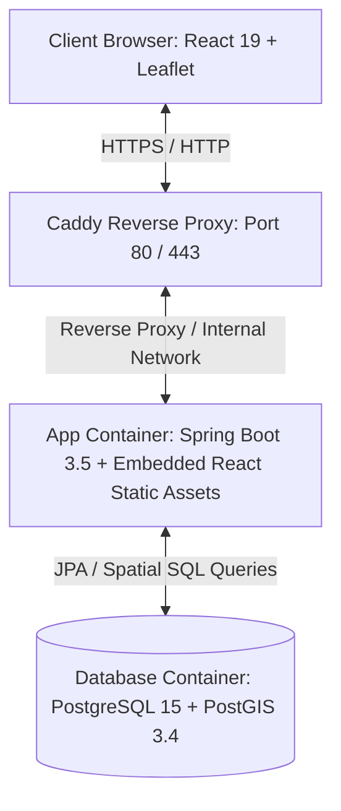

# Hệ Thống Quản Lý Thông Tin Hành Chính & Tra Cứu Web GIS Cấp Tỉnh

[](https://www.oracle.com/java/)
[](https://spring.io/projects/spring-boot)
[](https://react.dev/)
[](https://vitejs.dev/)
[](https://www.postgresql.org/)
[](https://postgis.net/)
[](https://www.docker.com/)
[](LICENSE)

> **Hệ thống Quản lý Thông tin Hành chính & Tra cứu GIS Cấp tỉnh (Gia Lai Web GIS Template)** là nền tảng quản trị và tra cứu dữ liệu địa lý không gian, ranh giới hành chính cấp Xã/Phường/Thị trấn và các đơn vị trực thuộc. Hệ thống được thiết kế độc lập, bảo mật dữ liệu tuyệt đối và không phụ thuộc vào các dịch vụ bản đồ tính phí của bên thứ ba.

---

## 📋 Mục Lục

- [🎯 Giới Thiệu Dự Án](#-giới-thiệu-dự-án)
- [✨ Tính Năng Nổi Bật](#-tính-năng-nổi-bật)
- [🛠️ Công Nghệ Sử Dụng](#%EF%B8%8F-công-nghệ-sử-dụng)
- [🏗️ Kiến Trúc Hệ Thống](#%EF%B8%8F-kiến-trúc-hệ-thống)
- [📁 Cấu Trúc Dự Án](#-cấu-trúc-dự-án)
- [🚀 Hướng Dẫn Cài Đặt & Khởi Chạy](#-hướng-dẫn-cài-đặt--khởi-chạy)
  - [Yêu Cầu Tiền Trạm](#1-yêu-cầu-tiền-trạm-prerequisites)
  - [Chạy Môi Trường Phát Triển (Local Dev)](#2-chạy-môi-trường-phát-triển-local-dev)
  - [Triển Khai Bằng Docker Compose (Production)](#3-triển-khai-bằng-docker-compose-production)
- [🔑 Tài Khoản Khởi Tạo & Phân Quyền](#-tài-khoản-khởi-tạo--phân-quyền)
- [📡 Các API Endpoints Chính](#-các-api-endpoints-chính)
- [📚 Tài Liệu Tham Khảo](#-tài-liệu-tham-khảo)
- [📄 Giấy Phép (License)](#-giấy-phép-license)

---

## 🎯 Giới Thiệu Dự Án

Dự án **Gia Lai Web GIS Template** đáp ứng nhu cầu số hóa thông tin hành chính địa phương (áp dụng mã hành chính chính thức **52** cho tỉnh Gia Lai hợp nhất).

Hệ thống đóng vai trò làm khung mẫu cơ sở (Template Framework) cho phép mở rộng linh hoạt theo từng giai đoạn và bật/tắt các module chuyên ngành (OCOP, Khoa học Công nghệ, Nông nghiệp, Điểm du lịch...) thông qua cơ chế **Compile-time Modularity & Feature Toggles**.

### Mục Tiêu Cốt Lõi:

1. **Chủ quyền dữ liệu địa lý:** Tự lưu trữ và xử lý ranh giới hình học (`MultiPolygon`) và điểm tọa độ (`Point`) trực tiếp từ PostgreSQL/PostGIS.
2. **Hiệu năng & Tối ưu hóa:** Sử dụng Tile Layer mở (CartoDB) và render ranh giới động bằng Leaflet dạng GeoJSON.
3. **Mô hình triển khai gọn nhẹ:** Đóng gói ứng dụng Fullstack (Spring Boot + static React build) trong **1 Docker Image duy nhất**, được bảo vệ bởi Caddy Reverse Proxy hỗ trợ tự động HTTPS.

---

## ✨ Tính Năng Nổi Bật

- 🗺️ **Tra Cứu Bản Đồ GIS Tương Tác:**
  - Hiển thị ranh giới chi tiết từng Xã/Phường/Thị trấn theo định dạng GeoJSON `MultiPolygon`.
  - Tự động zoom, bao quát ranh giới (fit bounds) và làm nổi bật (highlight) khi di chuột hoặc click chọn đơn vị.
  - Hiển thị thông số diện tích (km²), thông tin đại diện hành chính trực tiếp trên bản đồ.

- 🏛️ **Quản Lý Đơn Vị Hành Chính & Cán Bộ:**
  - Tìm kiếm nhanh thông tin đơn vị hành chính theo tên hoặc mã định danh.
  - Quản lý danh sách cán bộ lãnh đạo địa phương (Chủ tịch UBND, Phó Chủ tịch...).
    Note : Chưa triển khai data cán bộ.

- 🔐 **Xác Thực & Phân Quyền Người Dùng (RBAC):**
  - Bảo mật bằng Spring Security + JWT đóng gói an toàn trong **HttpOnly Cookie** (`gis_token`).
  - Hỗ trợ 2 nhóm quyền phân biệt:
    - **`ADMIN`**: Toàn quyền quản trị tài khoản người dùng và dữ liệu.
    - **`VIEWER`**: Quyền tra cứu bản đồ và xem thông tin hành chính.

- 🧩 **Kiến Trúc Module Linh Hoạt (Feature Toggles):**
  - Cho phép bật/tắt các module chuyên ngành (OCOP, Khoa học Công nghệ, Nông nghiệp) bằng biến môi trường mà không ảnh hưởng tới core hệ thống.

- 📑 **Tài Liệu API & Monitoring Tự Động:**
  - Tích hợp sẵn Swagger UI / OpenAPI 3.0 và Spring Boot Actuator để kiểm tra sức khỏe hệ thống (Health Check).

---

## 🛠️ Công Nghệ Sử Dụng

### Frontend (`/FE`)

| Công Nghệ                   | Phiên Bản       | Vai Trò                                            |
| :-------------------------- | :-------------- | :------------------------------------------------- |
| **React**                   | `v19.0`         | Thư viện xây dựng giao diện người dùng             |
| **TypeScript**              | `v6.0`          | Đảm bảo tính chặt chẽ về kiểu dữ liệu (Type-safe)  |
| **Vite**                    | `v8.1`          | Build tool và HMR dev server siêu tốc              |
| **Leaflet & React Leaflet** | `v1.9` / `v5.0` | Hiển thị bản đồ GIS và các lớp địa lý GeoJSON      |
| **Tailwind CSS**            | `v4.3`          | Utility-first CSS framework thiết kế UI hiện đại   |
| **React Router**            | `v7.1`          | Điều hướng Client-side                             |
| **Axios**                   | `v1.18`         | Gửi HTTP requests với cấu hình credentials tự động |

### Backend (`/BE`)

| Công Nghệ                               | Phiên Bản | Vai Trò                                                                  |
| :-------------------------------------- | :-------- | :----------------------------------------------------------------------- |
| **Java**                                | `17`      | Ngôn ngữ lập trình chính                                                 |
| **Spring Boot**                         | `v3.5`    | Framework backend phát triển RESTful API                                 |
| **Spring Security**                     | `v3.5`    | Xử lý xác thực JWT & phân quyền người dùng                               |
| **Spring Data JPA & Hibernate Spatial** | `v3.5`    | ORM và xử lý kiểu dữ liệu không gian PostGIS                             |
| **JTS Core (LocationTech)**             | `v1.19`   | Thư viện hình học và xử lý truy vấn không gian                           |
| **Flyway DB**                           | `v10.x`   | Tự động quản lý và migrate schema/dữ liệu cơ sở dữ liệu                  |
| **MapStruct & Lombok**                  | `v1.6`    | Tự động hóa ánh xạ DTO $\leftrightarrow$ Entity và giảm boilerplate code |
| **Springdoc OpenAPI**                   | `v2.8`    | Sinh tự động giao diện tra cứu Swagger UI                                |

### Cơ Sở Dữ Liệu & Infrastructure

| Công Nghệ                   | Phiên Bản   | Vai Trò                                                             |
| :-------------------------- | :---------- | :------------------------------------------------------------------ |
| **PostgreSQL**              | `v15`       | Hệ quản trị cơ sở dữ liệu quan hệ                                   |
| **PostGIS**                 | `v3.4`      | Phần mở rộng dữ liệu không gian cho PostgreSQL                      |
| **Docker & Docker Compose** | Latest      | Container hóa toàn bộ hệ thống                                      |
| **Caddy**                   | `v2-alpine` | Reverse Proxy đóng vai trò gateway, SSL termination & rate limiting |

---

## 🏗️ Kiến Trúc Hệ Thống



### Luồng Dữ Liệu Địa Lý (GIS Data Flow):

1. **PostgreSQL/PostGIS** lưu trữ dữ liệu ranh giới ở kiểu hình học `MULTIPOLYGON` (Hệ tọa độ WGS84 - SRID 4326).
2. **Spring Boot Backend** truy vấn dữ liệu thông qua Hibernate Spatial / JTS Core và chuyển đổi thành đối tượng Chuẩn GeoJSON.
3. **React Frontend** nhận GeoJSON qua REST API và render các lớp ranh giới lên khung bản đồ **Leaflet**.

---

## 📁 Cấu Trúc Dự Án

```text
WEB GIS TEMPLATE/
├── BE/                           # Mã nguồn Backend (Spring Boot Project)
│   ├── src/main/java/            # Mã nguồn Java (Controller, Service, Repository, Entity, GIS)
│   ├── src/main/resources/       # Configuration, Flyway Migrations (db/migration/core)
│   └── pom.xml                   # Cấu hình Maven dependencies
├── FE/                           # Mã nguồn Frontend (React + Vite Project)
│   ├── src/                      # Components, Pages, GIS Map layer components, Services
│   ├── package.json              # Npm dependencies & scripts
│   └── vite.config.ts            # Cấu hình Vite build
├── docs/                         # Tài liệu kỹ thuật chi tiết
│   └── en/                       # Specs (API_CONTRACT, ARCHITECTURE, DEVELOPMENT_SETUP...)
├── Caddyfile                     # Cấu hình Caddy Reverse Proxy
├── Dockerfile                    # Multi-stage Dockerfile (FE Build -> BE Embed -> Runtime)
├── docker-compose.yml            # Docker Compose orchestration (App + PostGIS + Caddy)
├── .env.example                  # File biến môi trường mẫu cho Docker
└── README.md                     # File hướng dẫn dự án (Tài liệu này)
```

---

## 🚀 Hướng Dẫn Cài Đặt & Khởi Chạy

### 1. Yêu Cầu Tiền Trạm (Prerequisites)

Dành cho môi trường phát triển local:

- **Java JDK 17** (Eclipse Temurin hoặc OpenJDK)
- **Node.js** (Phiên bản LTS) & **pnpm** (`npm i -g pnpm`)
- **PostgreSQL 15+** đã bật extension **PostGIS**
- **Docker & Docker Compose** (nếu muốn chạy bằng Container)

---

### 2. Chạy Môi Trường Phát Triển (Local Dev)

#### Bước 2.1: Khởi Tạo Database PostgreSQL + PostGIS

Đăng nhập vào PostgreSQL (qua pgAdmin, DBeaver hoặc psql) và chạy câu lệnh:

```sql
CREATE DATABASE gialai;
\c gialai;
CREATE EXTENSION postgis;
```

#### Bước 2.2: Khởi Chạy Backend (Spring Boot)

1. Tạo file cấu hình từ file mẫu:
   ```bash
   cd BE/src/main/resources
   cp application.properties.example application.properties
   ```
2. Cập nhật thông tin kết nối DB trong `application.properties`:
   ```properties
   spring.datasource.url=jdbc:postgresql://localhost:5432/gialai
   spring.datasource.username=your_postgres_user
   spring.datasource.password=your_postgres_password
   ```
3. Chạy ứng dụng Spring Boot (Flyway sẽ tự động tạo bảng và nạp dữ liệu mẫu):
   ```bash
   cd BE
   ./mvnw spring-boot:run
   ```
   _(Trên Windows PowerShell: `.\mvnw.cmd spring-boot:run`)_

Backend sẽ chạy tại: **`http://localhost:8080`**  
Tra cứu Swagger UI tại: **`http://localhost:8080/swagger-ui.html`**

#### Bước 2.3: Khởi Chạy Frontend (React + Vite)

1. Tạo file `.env` tại thư mục `/FE`:
   ```env
   VITE_API_BASE_URL=http://localhost:8080
   ```
2. Cài đặt thư viện và khởi chạy dev server:
   ```bash
   cd FE
   pnpm install
   pnpm dev
   ```

Vấn truy cập giao diện web tại: **`http://localhost:5173`**

---

### 3. Triển Khai Bằng Docker Compose (Production)

Để triển khai toàn bộ ứng dụng (App + PostGIS + Caddy Proxy) chỉ với 1 câu lệnh:

1. Sao chép và điền thông tin môi trường:

   ```bash
   cp .env.example .env
   ```

   _(Chỉnh sửa mật khẩu `POSTGRES_PASSWORD`, `JWT_SECRET` trong file `.env`)_

2. Khởi chạy bằng Docker Compose:

   ```bash
   docker compose up -d --build
   ```

3. Kiểm tra trạng thái các container:
   ```bash
   docker compose ps
   ```

Ứng dụng sẽ hoạt động qua Caddy Proxy tại cổng **`80` / `443`**.

---

## 🔑 Tài Khoản Khởi Tạo & Phân Quyền

Khi bật tùy chọn khởi tạo tài khoản mặc định cho môi trường local dev (`SEED_DEFAULT_ACCOUNTS=true`), hệ thống hỗ trợ 2 tài khoản thử nghiệm:

| Tên Đăng Nhập | Mật Khẩu Khởi Tạo                     | Vai Trò (Role) | Phân Quyền                                                 |
| :------------ | :------------------------------------ | :------------- | :--------------------------------------------------------- |
| **`admin`**   | _Cấu hình qua `SEED_ADMIN_PASSWORD`_  | `ADMIN`        | Quản lý tài khoản, xem & cập nhật dữ liệu bản đồ           |
| **`viewer`**  | _Cấu hình qua `SEED_VIEWER_PASSWORD`_ | `VIEWER`       | Tra cứu ranh giới bản đồ & thông tin Xã/Phường (Read-only) |

> ⚠️ **Lưu ý Bảo Mật:** Tuyệt đối không bật `SEED_DEFAULT_ACCOUNTS=true` trên môi trường Production.

---

## 📡 Các API Endpoints Chính

### 🔒 Authenticaton (Xác Thực)

- `POST /api/auth/login` - Đăng nhập hệ thống (Trả về HttpOnly JWT Cookie).
- `GET /api/auth/me` - Lấy thông tin tài khoản đang đăng nhập.
- `POST /api/auth/logout` - Đăng xuất & xóa Cookie xác thực.

### 👥 User Management (Quản Lý Người Dùng - Chỉ Admin)

- `GET /api/admin/users` - Danh sách người dùng hệ thống.
- `POST /api/admin/users` - Tạo tài khoản người dùng mới.
- `PUT /api/admin/users/{id}` - Cập nhật thông tin/mật khẩu người dùng.
- `DELETE /api/admin/users/{id}` - Xóa tài khoản người dùng.

### 🗺️ Administrative Units & GIS (Đơn Vị Hành Chính & Dữ Liệu Bản Đồ)

- `GET /api/wards` - Tra cứu danh sách Xã/Phường/Thị trấn (Hỗ trợ lọc theo query `q`).
- `GET /api/wards/{code}` - Lấy chi tiết thông tin hành chính & danh sách lãnh đạo đơn vị (Hiện tại không trả leader).
- `GET /api/wards/{code}/geojson` - Lấy tọa độ ranh giới định dạng GeoJSON MultiPolygon của 1 đơn vị.
- `GET /api/wards/geojson` - Lấy toàn bộ GeoJSON `FeatureCollection` ranh giới các đơn vị trong tỉnh.

---

## 📚 Tài Liệu Tham Khảo

Tài liệu thiết kế chi tiết được lưu trữ tại thư mục [`/docs/en`](./docs/en):

- [📄 Project Overview](./docs/en/PROJECT_OVERVIEW.md) - Tổng quan dự án & Lộ trình phát triển.
- [🏛️ Architecture Specification](./docs/en/ARCHITECTURE%20SPECIFICATION.md) - Đặc tả kiến trúc & Mô hình Modularity.
- [🔌 API Contract Specification](./docs/en/API_CONTRACT.md) - Quy chuẩn RESTful API & DTOs.
- [🗄️ Data Model Specification](./docs/en/DATA_MODEL.md) - Cấu trúc bảng CSDL & Thuộc tính GIS.
- [💻 Development Setup Guide](./docs/en/DEVELOPMENT_SETUP.md) - Hướng dẫn chi tiết setup môi trường dev.
- [🚀 Deployment Strategy](./docs/en/DEPLOYMENT%20%26%20FLEET%20STRATEGY.md) - Chiến lược đóng gói Docker & Triển khai VPS.

---

## 📄 Giấy Phép (License)

Dự án được phân phối dưới giấy phép **[MIT License](LICENSE)**. Xem chi tiết tại file LICENSE.

---

<p center="align">
  <i>Được phát triển với ❤️ cho Hệ thống Thông tin Địa lý (GIS) & Quản lý Hành chính Cấp tỉnh.</i>
</p>
