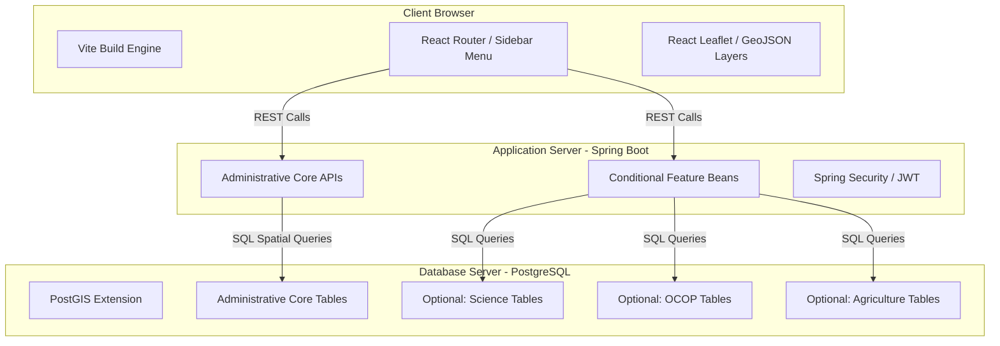
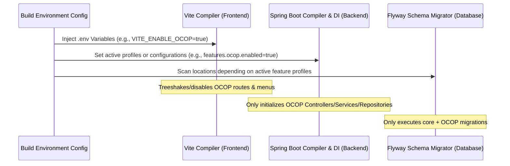
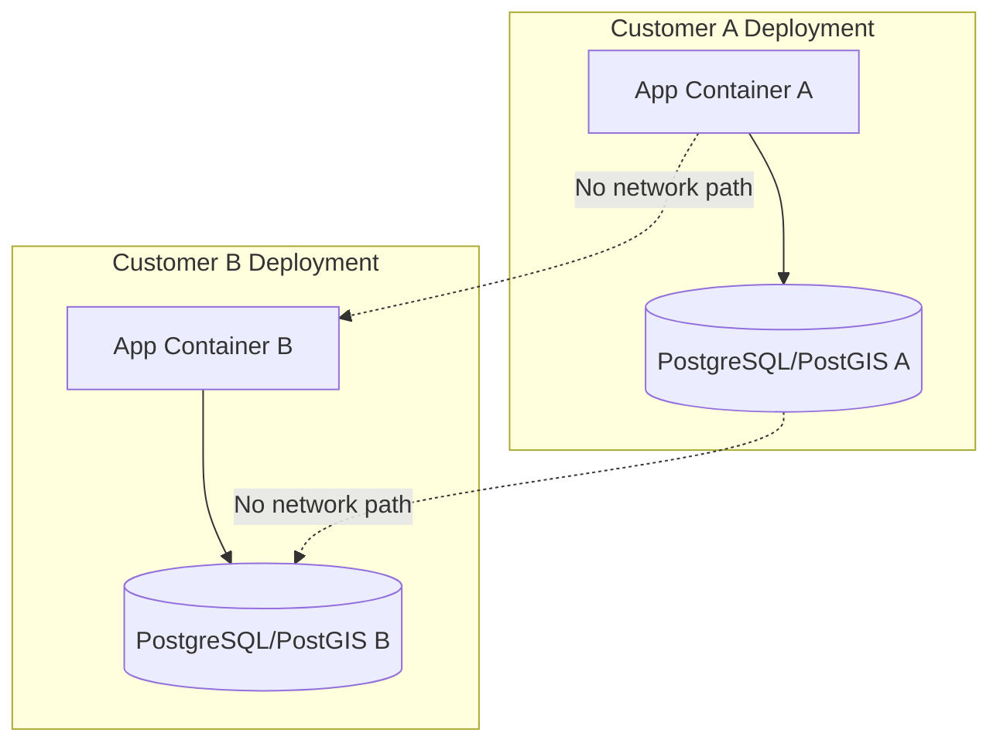

# SYSTEM ARCHITECTURE & MODULARITY SPECIFICATION

This document outlines the system architecture design for the Provincial Administrative Information Management and GIS Lookup System, detailing how compile-time modularity (Feature Toggling) is implemented across the Frontend, Backend, and Database tiers.

---

## 1. Architectural Design Overview

The system follows a standard three-tier architecture split into:

1. **Presentation Layer (Frontend):** React (Vite) + Leaflet (Map rendering) + Tailwind CSS (Styling).
2. **Application Layer (Backend):** Spring Boot (Java 17) + Spring Security (JWT auth) + Hibernate Spatial.
3. **Database Layer (Storage):** PostgreSQL with PostGIS extensions + local file storage.

### 1.1. System Component Block Diagram



---

## 2. Compile-Time Modularity (Feature Toggling)

To deliver bespoke packages for different clients (e.g., Client A only needs OCOP, Client B only needs science & agriculture) without maintaining separate codebases, the system utilizes a **Compile-time Modularity** pattern. Feature flags are set during the build stage, prompting compilers and dependency injection containers to exclude or ignore deactivated features.



---

## 3. Frontend Modularity Implementation (React + Vite)

Modularity in the frontend is controlled by environment variables injected at build time.

### 3.1. Environment Configuration (`.env`)

Each client deployment will have its own `.env` file containing feature switches:

```env
# Core Administrative Configurations
VITE_API_BASE_URL=http://localhost:8080/api
VITE_PROVINCE_CODE=52

# Feature Modularity Toggles
VITE_ENABLE_SCIENCE=false
VITE_ENABLE_OCOP=true
VITE_ENABLE_AGRICULTURE=false
```

### 3.2. Dynamic Routing & Menu Filtering

The sidebar menu and router read environment variables to register paths:

```typescript
// src/config/features.ts
export const FEATURE_FLAGS = {
  science: import.meta.env.VITE_ENABLE_SCIENCE === 'true',
  ocop: import.meta.env.VITE_ENABLE_OCOP === 'true',
  agriculture: import.meta.env.VITE_ENABLE_AGRICULTURE === 'true',
};

// src/router/index.tsx
import { RouteObject } from 'react-router-dom';
import { FEATURE_FLAGS } from '../config/features';

const baseRoutes: RouteObject[] = [
  { path: '/', element: <Dashboard /> },
  { path: '/admin-map', element: <AdministrativeMap /> },
];

const featureRoutes: RouteObject[] = [];

if (FEATURE_FLAGS.ocop) {
  featureRoutes.push({
    path: '/ocop',
    lazy: () => import('../pages/ocop/OcopManagement'), // Lazy loaded for code splitting
  });
}
if (FEATURE_FLAGS.science) {
  featureRoutes.push({
    path: '/science',
    lazy: () => import('../pages/science/ScienceManagement'),
  });
}

export const routes = [...baseRoutes, ...featureRoutes];
```

### 3.3. Map Layer Control (Leaflet)

On the interactive GIS map, overlays are conditionally loaded:

```typescript
// src/components/map/GisMap.tsx
import React from 'react';
import { LayersControl } from 'react-leaflet';
import { FEATURE_FLAGS } from '../../config/features';
import { OcopMarkers } from './OcopMarkers';
import { ScienceMarkers } from './ScienceMarkers';

export const GisMap: React.FC = () => {
  return (
    <LayersControl position="topright">
      {FEATURE_FLAGS.ocop && (
        <LayersControl.Overlay name="OCOP">
          <OcopMarkers />
        </LayersControl.Overlay>
      )}
      {FEATURE_FLAGS.science && (
        <LayersControl.Overlay name="Science & Tech">
          <ScienceMarkers />
        </LayersControl.Overlay>
      )}
    </LayersControl>
  );
};
```

---

## 4. Backend Modularity Implementation (Spring Boot)

At the Backend, feature toggles are driven by Spring Application configuration property keys and Spring Profiles, controlling the dependency injection (DI) lifecycle.

### 4.1. Package Structure

Core administrative capabilities are separated from feature packages. This structure allows feature directories to be safely modified, omitted, or skipped.

```
BE/src/main/java/com/website/gis/
|── config/
├── core/                         # Core administrative packages
│   ├── controller/               # Administrative Unit Controllers
│   ├── dto/                      # Data Transfer Objects
│   ├── exception/                # Handling Errors
│   ├── entity/                   # Administrative Unit & User Entities
│   ├── repository/               # Basic JpaRepositories
│   └── security/                 # Spring Security & JWT components
└── features/                     # Pluggable features/modules
    ├── ocop/
    │   ├── OcopController.java
    │   ├── OcopService.java
    │   └── OcopRepository.java
    └── science/
        ├── ScienceController.java
        ├── ScienceService.java
        └── ScienceRepository.java
```

### 4.2. Conditional Spring Bean Initialization

Controllers, services, and repositories for optional features use Spring Boot's `@ConditionalOnProperty` annotation. If disabled, Spring will not create these beans, meaning their REST endpoints are never registered:

```java
package com.website.gis.features.ocop;

import org.springframework.boot.autoconfigure.condition.ConditionalOnProperty;
import org.springframework.web.bind.annotation.RequestMapping;
import org.springframework.web.bind.annotation.RestController;

@RestController
@RequestMapping("/api/ocop")
@ConditionalOnProperty(name = "features.ocop.enabled", havingValue = "true")
public class OcopController {
    private final OcopService ocopService;

    public OcopController(OcopService ocopService) {
        this.ocopService = ocopService;
    }

    // Endpoints mapped here return 404 (Not Found) if disabled,
    // as Spring Boot does not load the controller bean at startup.
}
```

### 4.3. Application Settings Configuration (`application.yml`)

The main backend settings config:

```yaml
features:
  science:
    enabled: ${ENABLE_SCIENCE:false}
  ocop:
    enabled: ${ENABLE_OCOP:false}
  agriculture:
    enabled: ${ENABLE_AGRICULTURE:false}
```

---

## 5. Database Schema Modularity Strategy (Flyway)

To ensure client databases do not have ghost tables for features they did not request (e.g. creating the `science` table for a client that only wants `ocop`), Flyway migrations are partitioned by folder directories.

### 5.1. Flyway Directory Structure

```
BE/src/main/resources/db/migration/
├── core/
│   ├── V1__init_auth_schema.sql         # Base user authentication schema
│   └── V2__init_admin_units_schema.sql  # Administrative boundaries
├── science/
│   └── V3_1__create_science_table.sql   # Specific schema for science
└── ocop/
    └── V3_2__create_ocop_table.sql      # Specific schema for ocop
```

### 5.2. Dynamic Flyway Scan Locations Configuration

To merge active folders at run time based on active configurations, a configuration bean dynamically customizes the Flyway locations path list:

```java
package com.website.gis.config;

import org.springframework.beans.factory.annotation.Value;
import org.springframework.boot.autoconfigure.flyway.FlywayConfigurationCustomizer;
import org.springframework.context.annotation.Bean;
import org.springframework.context.annotation.Configuration;

import java.util.ArrayList;
import java.util.List;

@Configuration
public class DynamicFlywayConfig {

    @Value("${features.science.enabled:false}")
    private boolean scienceEnabled;

    @Value("${features.ocop.enabled:false}")
    private boolean ocopEnabled;

    @Value("${features.agriculture.enabled:false}")
    private boolean agricultureEnabled;

    @Bean
    public FlywayConfigurationCustomizer flywayConfigurationCustomizer() {
        return configuration -> {
            List<String> locations = new ArrayList<>();
            // Core migrations must always execute
            locations.add("classpath:db/migration/core");

            // Conditionally append modular migrations based on active feature config
            if (scienceEnabled) {
                locations.add("classpath:db/migration/science");
            }
            if (ocopEnabled) {
                locations.add("classpath:db/migration/ocop");
            }
            if (agricultureEnabled) {
                locations.add("classpath:db/migration/agriculture");
            }

            configuration.locations(locations.toArray(new String[0]));
        };
    }
}
```

This ensures that only database tables matching the active modules are initialized in the target customer database. It avoids schema clutter, maintains table integrity, and keeps database sizes and structures exactly aligned with client purchase orders.

---

## 6. Multi-Customer Deployment & Isolation Strategy

> **Status note (2026-07):** the project currently has exactly **one** deployed tenant (Gia Lai, code `52`). This section documents the isolation model **decision** so it is fixed before a second customer exists — not a description of a fleet that is already running. Operational rollout mechanics live in `DEPLOYMENT & FLEET STRATEGY.md`.

### 6.1. Isolation Model Decision: Database-per-Customer

Each customer runs as a **fully separate application container and a fully separate database instance**. This is a deliberate rejection of the alternative — a single shared, multi-tenant database with row-level filtering (e.g. a `tenant_id` column on every table).



**Why database-per-customer instead of shared multi-tenant:**

| Concern                                          | Shared DB + `tenant_id`                                                           | Database-per-customer (adopted)                                                           |
| :----------------------------------------------- | :-------------------------------------------------------------------------------- | :---------------------------------------------------------------------------------------- |
| Cross-tenant data leak risk                      | A missed `WHERE tenant_id = ?` clause anywhere leaks another customer's data      | Structurally impossible — there is no network or code path between tenants                |
| Schema changes for one customer's feature module | Awkward — must add nullable/unused columns for tenants who didn't buy that module | Trivial — that customer's DB simply doesn't run that Flyway feature migration (Section 5) |
| Backup/restore granularity                       | Restoring one customer means restoring rows out of a shared dump                  | Restoring one customer is restoring one independent database                              |
| Data sovereignty per customer contract           | Harder to prove in isolation                                                      | Each customer's data physically lives in its own database instance                        |

**Concrete consequence for the codebase:** no table in `DATA_MODEL.md` should ever gain a `tenant_id`/`customer_id` column, and no repository/query in this codebase should ever filter by tenant. If such a column or filter appears in a pull request, that is a sign the isolation model in this section is being silently abandoned — flag it in review rather than merging it.

### 6.2. What Actually Differs Between Customer Deployments

Given the isolation model above, every customer runs the **same application artifact** (the Docker image built in `DEPLOYMENT & FLEET STRATEGY.md` Section 3). What differs per customer is purely **configuration**, not code:

| Layer    | What varies per customer                                                                      |
| :------- | :-------------------------------------------------------------------------------------------- |
| Frontend | `.env` build-time feature flags (`VITE_ENABLE_OCOP`, etc. — Section 3.1)                      |
| Backend  | `application.properties`/env-var feature flags (`features.ocop.enabled`, etc. — Section 4.3)  |
| Database | Which Flyway feature folders get scanned (Section 5.2) — determines which tables exist at all |
| Infra    | A dedicated database instance and, per Section 7, a dedicated deployment slot                 |

Because the differences are entirely configuration-driven, onboarding a new customer never requires a source code branch or fork — only a new `.env` and a new empty database.

### 6.3. Infrastructure Placement vs. Logical Isolation

`PROJECT_OVERVIEW.md` Section 7.4 already draws this distinction; it is restated here as the authoritative version:

- **Logical/data isolation** (Section 6.1) is a hard guarantee: separate app process, separate database, no shared network path.
- **Physical infrastructure placement** is a cost decision, independent of the above: multiple customers' independent stacks (app + own DB, per Section 6.1) _may_ run on the same physical VPS for cost efficiency, provided each still gets its own containers, own database, own volumes, and no shared network between customer stacks. Co-locating on one VPS is purely about hosting cost; it must never become an excuse to share a database or add tenant-filtering code.

### 6.4. Geometry Type Convention Across Feature Modules

> **Naming note (2026-07):** this section originally used the Vietnamese abbreviation `khcn` for the "Khoa học Công nghệ" (Science & Technology) module. That has been standardized back to `science` everywhere in this document and across `DATA_MODEL.md`/`API_CONTRACT.md`/`CODING_CONVENTIONS.md`, to match the property name already used in real code (`features.science.enabled` in `DynamicFlywayConfig.java` and `application.properties.example`) and in Sections 3–5 of this same document. Use `science` as the single canonical module key going forward; do not reintroduce `khcn` in code, config, or docs.

Per `DATA_MODEL.md` Section 4, feature modules are not geometrically uniform, and the isolation/rollout mechanics above must accommodate both shapes:

- **Point-type modules** (`ocop`, `science`): one row per point of interest, `geometry(Point, 4326)` column. Rendered on the frontend as Leaflet markers (`ARCHITECTURE SPECIFICATION.md` Section 3.3 pattern — `OcopMarkers`, etc.).
- **Zone/polygon-type modules** (`nonglam`): optionally split business/spatial tables (mirroring the core `wards`/`gis_wards` pattern), `geometry(MultiPolygon, 4326)`. Rendered as `<GeoJSON>` polygon overlays, not markers.

A customer's feature flag combination may mix both shapes (e.g. Customer C running both `ocop` and `nonglam`); the isolation model in Section 6.1 treats this no differently — it's still one database per customer, just with more Flyway feature folders scanned (Section 5.2).

---

## 7. Fleet Management & Rollout Strategy

> This section defines _when and how_ the system moves beyond single-tenant hosting. It intentionally does not describe custom fleet automation (a bespoke registry file plus a hand-written rollout script) — that approach was considered and superseded. See `DEPLOYMENT & FLEET STRATEGY.md` Section 6 for the full rationale and operational detail; this section states the architectural decision it depends on.

### 7.1. Current Phase: No Fleet

With a single tenant, there is no fleet to manage — one VPS, one Docker Compose stack, manual deploys (`DEPLOYMENT & FLEET STRATEGY.md` Section 5.1). Building fleet tooling ahead of having a fleet would be speculative complexity; it is explicitly deferred.

### 7.2. Trigger for Fleet Tooling

The moment a second customer instance is onboarded, hosting moves from "one Compose stack, managed by hand" to "multiple isolated Compose stacks, managed through a control panel." That is the trigger point — not a fixed calendar date.

### 7.3. Decision: Self-Hosted PaaS, Not Custom Scripts

At that trigger point, the system adopts a self-hosted PaaS — **Dokploy** or **Coolify** (final choice deferred to when the trigger is hit, per `DEPLOYMENT & FLEET STRATEGY.md` Section 6.2) — to manage the fleet, rather than a bespoke fleet registry and deploy script. This keeps the operational burden appropriate for a small team while still satisfying every isolation guarantee in Section 6:

- One PaaS "project" per customer maps directly onto "one app container + one dedicated database" (Section 6.1) — the PaaS does not introduce shared infrastructure between customers.
- The same `Dockerfile`/`docker-compose.yml` artifact (`DEPLOYMENT & FLEET STRATEGY.md` Sections 3–4) is reused unchanged; adopting a PaaS is an operational change, not a re-architecture.
- Rolling out a fix to "all customers" or "one customer" (Section 7.4 below) becomes a per-project redeploy in the PaaS panel, never a shared-code-path change that could accidentally cross tenant boundaries.

### 7.4. Rollout Scenarios Under the PaaS Model

| Scenario                                           | How it's handled                                                                                                                                                                                                         |
| :------------------------------------------------- | :----------------------------------------------------------------------------------------------------------------------------------------------------------------------------------------------------------------------- |
| Core bug fix affecting all customers               | Redeploy each customer project from the same updated `main` branch — sequentially, verifying health after each, since each is an independent database (a failed migration on one customer's DB cannot affect another's). |
| Feature rollout to one customer only               | Toggle that customer's feature flag(s) (Section 6.2) and redeploy only that project; other customers' projects and databases are untouched.                                                                              |
| Core data correction (e.g. a `wards` boundary fix) | Apply as a new forward-only Flyway migration in `db/migration/core/`; it runs identically across every customer's database on their next redeploy — there is no per-customer core data divergence to reconcile.          |
| New customer onboarding                            | Per `DEPLOYMENT & FLEET STRATEGY.md` Section 6.3.                                                                                                                                                                        |
| Emergency rollback for one customer                | Redeploy that project's previous image tag; unaffected customers need no action, since there is no shared release train.                                                                                                 |

### 7.5. Operational Detail Lives Elsewhere

This section defines the decisions; it deliberately does not duplicate command-line steps, `.env` templates, or backup scripts. See `DEPLOYMENT & FLEET STRATEGY.md` for those, kept in one place to avoid the two documents drifting out of sync.
