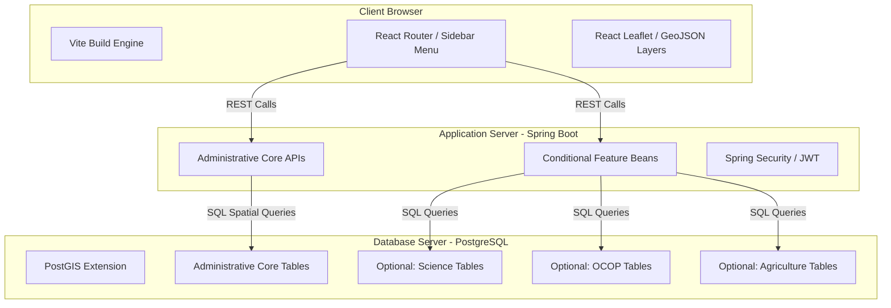
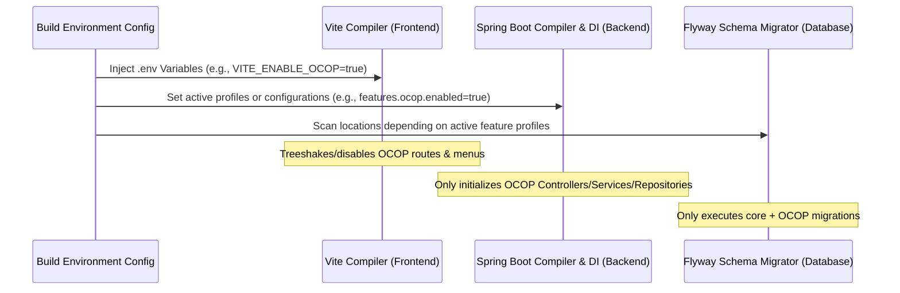

# SYSTEM ARCHITECTURE & MODULARITY SPECIFICATION

This document outlines the system architecture design for the Provincial Administrative Information Management and GIS Lookup System, detailing how compile-time modularity (Feature Toggling) is implemented across the Frontend, Backend, and Database tiers.

---

## 1. Architectural Design Overview

The system follows a standard three-tier architecture split into:

1. **Presentation Layer (Frontend):** React (Vite) + Leaflet (Map rendering) + Tailwind CSS (Styling).
2. **Application Layer (Backend):** Spring Boot (Java 17) + Spring Security (JWT auth) + Hibernate Spatial.
3. **Database Layer (Storage):** PostgreSQL with PostGIS extensions + local file storage.

### 1.1. System Component Block Diagram



---

## 2. Compile-Time Modularity (Feature Toggling)

To deliver bespoke packages for different clients (e.g., Client A only needs OCOP, Client B only needs science & agriculture) without maintaining separate codebases, the system utilizes a **Compile-time Modularity** pattern. Feature flags are set during the build stage, prompting compilers and dependency injection containers to exclude or ignore deactivated features.



---

## 3. Frontend Modularity Implementation (React + Vite)

Modularity in the frontend is controlled by environment variables injected at build time.

### 3.1. Environment Configuration (`.env`)

Each client deployment will have its own `.env` file containing feature switches:

```env
# Core Administrative Configurations
VITE_API_BASE_URL=http://localhost:8080/api
VITE_PROVINCE_CODE=52

# Feature Modularity Toggles
VITE_ENABLE_SCIENCE=false
VITE_ENABLE_OCOP=true
VITE_ENABLE_AGRICULTURE=false
```

### 3.2. Dynamic Routing & Menu Filtering

The sidebar menu and router read environment variables to register paths:

```typescript
// src/config/features.ts
export const FEATURE_FLAGS = {
  science: import.meta.env.VITE_ENABLE_SCIENCE === 'true',
  ocop: import.meta.env.VITE_ENABLE_OCOP === 'true',
  agriculture: import.meta.env.VITE_ENABLE_AGRICULTURE === 'true',
};

// src/router/index.tsx
import { RouteObject } from 'react-router-dom';
import { FEATURE_FLAGS } from '../config/features';

const baseRoutes: RouteObject[] = [
  { path: '/', element: <Dashboard /> },
  { path: '/admin-map', element: <AdministrativeMap /> },
];

const featureRoutes: RouteObject[] = [];

if (FEATURE_FLAGS.ocop) {
  featureRoutes.push({
    path: '/ocop',
    lazy: () => import('../pages/ocop/OcopManagement'), // Lazy loaded for code splitting
  });
}
if (FEATURE_FLAGS.science) {
  featureRoutes.push({
    path: '/science',
    lazy: () => import('../pages/science/ScienceManagement'),
  });
}

export const routes = [...baseRoutes, ...featureRoutes];
```

### 3.3. Map Layer Control (Leaflet)

On the interactive GIS map, overlays are conditionally loaded:

```typescript
// src/components/map/GisMap.tsx
import React from 'react';
import { LayersControl } from 'react-leaflet';
import { FEATURE_FLAGS } from '../../config/features';
import { OcopMarkers } from './OcopMarkers';
import { ScienceMarkers } from './ScienceMarkers';

export const GisMap: React.FC = () => {
  return (
    <LayersControl position="topright">
      {FEATURE_FLAGS.ocop && (
        <LayersControl.Overlay name="OCOP">
          <OcopMarkers />
        </LayersControl.Overlay>
      )}
      {FEATURE_FLAGS.science && (
        <LayersControl.Overlay name="Science & Tech">
          <ScienceMarkers />
        </LayersControl.Overlay>
      )}
    </LayersControl>
  );
};
```

---

## 4. Backend Modularity Implementation (Spring Boot)

At the Backend, feature toggles are driven by Spring Application configuration property keys and Spring Profiles, controlling the dependency injection (DI) lifecycle.

### 4.1. Package Structure

Core administrative capabilities are separated from feature packages. This structure allows feature directories to be safely modified, omitted, or skipped.

```
BE/src/main/java/com/website/gis/
├── core/                         # Core administrative packages
│   ├── controller/               # Administrative Unit Controllers
│   ├── dto/                      # Data Transfer Objects
│   ├── exception/                # Handling Errors
│   ├── entity/                   # Administrative Unit & User Entities
│   ├── repository/               # Basic JpaRepositories
│   └── security/                 # Spring Security & JWT components
└── features/                     # Pluggable features/modules
    ├── ocop/
    │   ├── OcopController.java
    │   ├── OcopService.java
    │   └── OcopRepository.java
    └── science/
        ├── ScienceController.java
        ├── ScienceService.java
        └── ScienceRepository.java
```

### 4.2. Conditional Spring Bean Initialization

Controllers, services, and repositories for optional features use Spring Boot's `@ConditionalOnProperty` annotation. If disabled, Spring will not create these beans, meaning their REST endpoints are never registered:

```java
package com.website.gis.features.ocop;

import org.springframework.boot.autoconfigure.condition.ConditionalOnProperty;
import org.springframework.web.bind.annotation.RequestMapping;
import org.springframework.web.bind.annotation.RestController;

@RestController
@RequestMapping("/api/ocop")
@ConditionalOnProperty(name = "features.ocop.enabled", havingValue = "true")
public class OcopController {
    private final OcopService ocopService;

    public OcopController(OcopService ocopService) {
        this.ocopService = ocopService;
    }

    // Endpoints mapped here return 404 (Not Found) if disabled,
    // as Spring Boot does not load the controller bean at startup.
}
```

### 4.3. Application Settings Configuration (`application.yml`)

The main backend settings config:

```yaml
features:
  science:
    enabled: ${ENABLE_SCIENCE:false}
  ocop:
    enabled: ${ENABLE_OCOP:false}
  agriculture:
    enabled: ${ENABLE_AGRICULTURE:false}
```

---

## 5. Database Schema Modularity Strategy (Flyway)

To ensure client databases do not have ghost tables for features they did not request (e.g. creating the `science` table for a client that only wants `ocop`), Flyway migrations are partitioned by folder directories.

### 5.1. Flyway Directory Structure

```
BE/src/main/resources/db/migration/
├── core/
│   ├── V1__init_auth_schema.sql         # Base user authentication schema
│   └── V2__init_admin_units_schema.sql  # Administrative boundaries
├── science/
│   └── V3_1__create_science_table.sql   # Specific schema for science
└── ocop/
    └── V3_2__create_ocop_table.sql      # Specific schema for ocop
```

### 5.2. Dynamic Flyway Scan Locations Configuration

To merge active folders at run time based on active configurations, a configuration bean dynamically customizes the Flyway locations path list:

```java
package com.website.gis.config;

import org.springframework.beans.factory.annotation.Value;
import org.springframework.boot.autoconfigure.flyway.FlywayConfigurationCustomizer;
import org.springframework.context.annotation.Bean;
import org.springframework.context.annotation.Configuration;

import java.util.ArrayList;
import java.util.List;

@Configuration
public class DynamicFlywayConfig {

    @Value("${features.science.enabled:false}")
    private boolean scienceEnabled;

    @Value("${features.ocop.enabled:false}")
    private boolean ocopEnabled;

    @Value("${features.agriculture.enabled:false}")
    private boolean agricultureEnabled;

    @Bean
    public FlywayConfigurationCustomizer flywayConfigurationCustomizer() {
        return configuration -> {
            List<String> locations = new ArrayList<>();
            // Core migrations must always execute
            locations.add("classpath:db/migration/core");

            // Conditionally append modular migrations based on active feature config
            if (scienceEnabled) {
                locations.add("classpath:db/migration/science");
            }
            if (ocopEnabled) {
                locations.add("classpath:db/migration/ocop");
            }
            if (agricultureEnabled) {
                locations.add("classpath:db/migration/agriculture");
            }

            configuration.locations(locations.toArray(new String[0]));
        };
    }
}
```

This ensures that only database tables matching the active modules are initialized in the target customer database. It avoids schema clutter, maintains table integrity, and keeps database sizes and structures exactly aligned with client purchase orders.
