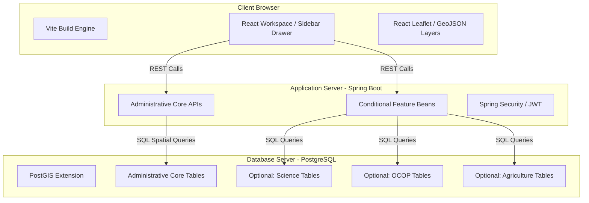
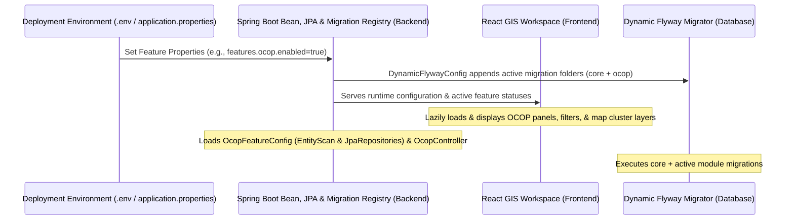
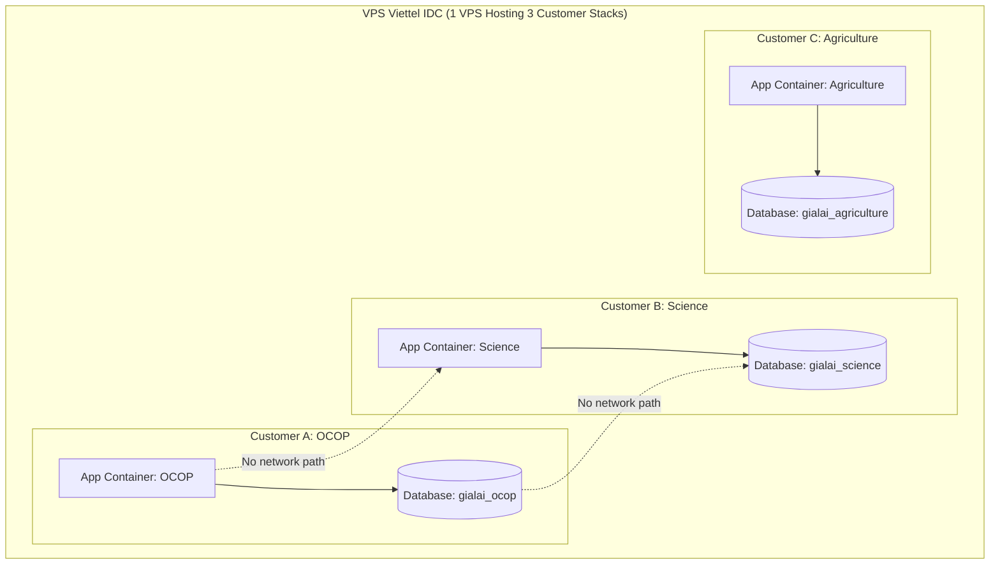

# SYSTEM ARCHITECTURE & MODULARITY SPECIFICATION

This document outlines the system architecture design for the Provincial Administrative Information Management and GIS Lookup System, detailing how modular feature toggling is implemented across Frontend (build-time code-splitting & tree-shaking), Backend (deployment-time config-driven beans & isolated JPA scanning), and Database (partitioned Flyway migrations).

---

## 1. Architectural Design Overview

The system follows a standard three-tier architecture split into:

1. **Presentation Layer (Frontend):** React (Vite) + Leaflet (Map rendering) + Tailwind CSS (Styling).
2. **Application Layer (Backend):** Spring Boot (Java 21) + Spring Security (JWT auth) + Hibernate Spatial.
3. **Database Layer (Storage):** PostgreSQL with PostGIS extensions + local file storage.

### 1.1. System Component Block Diagram


```mermaid
graph TD
    subgraph Client [Client Browser]
        Vite[Vite Build Engine]
        React[React Workspace / Sidebar Drawer]
        Map[React Leaflet / GeoJSON Layers]
    end

    subgraph Server [Application Server - Spring Boot]
        CoreAPI[Administrative Core APIs]
        FeatureRegistry[Conditional Feature Beans]
        Security[Spring Security / JWT]
    end

    subgraph Database [Database Server - PostgreSQL]
        PostGIS[PostGIS Extension]
        CoreSchema[Administrative Core Tables]
        ScienceSchema[Optional: Science Tables]
        OcopSchema[Optional: OCOP Tables]
        AgricultureSchema[Optional: Agriculture Tables]
    end

    React -->|REST Calls| CoreAPI
    React -->|REST Calls| FeatureRegistry
    CoreAPI -->|SQL Spatial Queries| CoreSchema
    FeatureRegistry -->|SQL Queries| ScienceSchema
    FeatureRegistry -->|SQL Queries| OcopSchema
    FeatureRegistry -->|SQL Queries| AgricultureSchema
```

---

## 2. Modular Feature Architecture (Feature Toggling)

To deliver bespoke packages for 3 provincial clients (Client 1: OCOP Gia Lai, Client 2: Science & Tech, Client 3: Agriculture) while maintaining a single, unified codebase and a **single Docker base image artifact** (12-Factor App), the system utilizes a **Coordinated Modularity** pattern:

- **Backend (Deployment-time / Configuration-driven):** Runtime feature flags (`features.*.enabled`) conditionally load Spring REST controllers, MapStruct mappers, Spring Data JPA repositories, and Hibernate Entity scanning via dedicated `*FeatureConfig` classes.
- **Frontend (Runtime-synchronized & Build-friendly):** In development, `.env` flags (`VITE_ENABLE_*`) can be used for isolated testing. In multi-container Docker deployments built from a single image, the frontend reads enabled modules dynamically from the backend container at runtime, eliminating the need to compile separate frontend artifacts for each customer.
- **Database (Dynamic Migration Partitioning):** Flyway dynamically calculates the migration classpath scan list, creating only tables corresponding to enabled features.


```mermaid
sequenceDiagram
    participant Config as Deployment Environment (.env / application.properties)
    participant BE as Spring Boot Bean, JPA & Migration Registry (Backend)
    participant FE as React GIS Workspace (Frontend)
    participant DB as Dynamic Flyway Migrator (Database)

    Config->>BE: Set Feature Properties (e.g., features.ocop.enabled=true)
    BE->>DB: DynamicFlywayConfig appends active migration folders (core + ocop)
    BE->>FE: Serves runtime configuration & active feature statuses
    Note over FE: Lazily loads & displays OCOP panels, filters, & map cluster layers
    Note over BE: Loads OcopFeatureConfig (EntityScan & JpaRepositories) & OcopController
    Note over DB: Executes core + active module migrations
```

---

## 3. Frontend Modularity Implementation (React + Vite)

Modularity in the frontend operates seamlessly across local development and single-artifact production container deployments.

### 3.1. Environment Configuration & Runtime Synchronization

In local development, developers can toggle features directly via `.env`:

```env
# Core Administrative Configurations
# In local dev: http://localhost:8080. In Docker production (same origin via Caddy): leave empty ("")
VITE_API_BASE_URL=

# Feature Modularity Toggles
VITE_ENABLE_SCIENCE=false
VITE_ENABLE_OCOP=true
VITE_ENABLE_AGRICULTURE=false
```

In production, since the frontend is embedded directly into the Spring Boot fat JAR (`src/main/resources/static`) inside a single Docker image artifact, the frontend dynamically synchronizes with the backend container's active feature set upon initialization.

### 3.2. Dynamic View Switching & Component Code Splitting

Rather than navigating away to separate URL routes (which would unmount the Leaflet map instance, reload map tiles, and discard the user's active viewport and cached boundary GeoJSON), the frontend operates as a unified **Single GIS Workspace Canvas** (`Home.tsx`).

Module navigation is orchestrated via an `activeView` state (`'map' | 'admin' | 'ocop' | 'science' | 'agriculture'`) combined with **Component-Level Lazy Loading** (`React.lazy()` + `<Suspense>`). This preserves the interactive map context while code-splitting heavy management panels, forms, and CRUD modals out of the initial bundle.

```typescript
// src/config/features.ts
export const FEATURE_FLAGS = {
  ocop: import.meta.env.VITE_ENABLE_OCOP === "true",
  science: import.meta.env.VITE_ENABLE_SCIENCE === "true",
  agriculture: import.meta.env.VITE_ENABLE_AGRICULTURE === "true",
} as const;

export type FeatureFlagKey = keyof typeof FEATURE_FLAGS;

export const isFeatureEnabled = (key: FeatureFlagKey): boolean => {
  return FEATURE_FLAGS[key];
};
```

```typescript
// src/pages/Home.tsx
import React, { useState, Suspense, lazy } from 'react';
import { FEATURE_FLAGS } from '../config/features';
import SidebarDrawer, { type ActiveViewType } from './home/components/SidebarDrawer';
import GisMap from './home/components/GisMap';

// Code-splitting: Management panels (+ all modals & tables each of them imports)
// are only fetched over the network when the user actively navigates to them from the sidebar.
const AdminPanel = lazy(() => import('./home/components/AdminPanel'));
const OcopPanel = lazy(() => import('./home/components/OcopPanel'));
const SciencePanel = lazy(() => import('./home/components/SciencePanel'));
const AgriculturePanel = lazy(() => import('./home/components/AgriculturePanel'));

const PanelLoadingFallback: React.FC = () => (
  <div className="w-full h-full flex items-center justify-center">
    <div className="animate-spin rounded-full h-10 w-10 border-t-2 border-b-2 border-primary-500" />
  </div>
);

const Home: React.FC = () => {
  const [activeView, setActiveView] = useState<ActiveViewType>('map');

  const renderActiveView = () => {
    switch (activeView) {
      case 'admin':
        return (
          <Suspense fallback={<PanelLoadingFallback />}>
            <AdminPanel setActiveView={setActiveView} />
          </Suspense>
        );
      case 'ocop':
        if (!FEATURE_FLAGS.ocop) return null;
        return (
          <Suspense fallback={<PanelLoadingFallback />}>
            <OcopPanel setActiveView={setActiveView} />
          </Suspense>
        );
      case 'science':
        if (!FEATURE_FLAGS.science) return null;
        return (
          <Suspense fallback={<PanelLoadingFallback />}>
            <SciencePanel setActiveView={setActiveView} />
          </Suspense>
        );
      case 'agriculture':
        if (!FEATURE_FLAGS.agriculture) return null;
        return (
          <Suspense fallback={<PanelLoadingFallback />}>
            <AgriculturePanel setActiveView={setActiveView} />
          </Suspense>
        );
      case 'map':
      default:
        return <GisMap /* ...layers & spatial props */ />;
    }
  };

  return (
    <div className="w-full h-screen relative bg-white overflow-hidden font-sans">
      <div className="absolute inset-0 z-0 bg-neutral-100 flex items-center justify-center">
        {renderActiveView()}
      </div>

      {activeView === 'map' && (
        <SidebarDrawer
          activeView={activeView}
          setActiveView={setActiveView}
          /* ...layer toggles */
        />
      )}
    </div>
  );
};
```

### 3.3. Map Layer Control (Leaflet)

On the interactive GIS map, overlays are conditionally loaded:

```typescript
// src/components/map/GisMap.tsx
import React from 'react';
import { LayersControl } from 'react-leaflet';
import { FEATURE_FLAGS } from '../../config/features';
import { OcopMarkers } from './OcopMarkers';
import { ScienceMarkers } from './ScienceMarkers';

export const GisMap: React.FC = () => {
  return (
    <LayersControl position="topright">
      {FEATURE_FLAGS.ocop && (
        <LayersControl.Overlay name="OCOP">
          <OcopMarkers />
        </LayersControl.Overlay>
      )}
      {FEATURE_FLAGS.science && (
        <LayersControl.Overlay name="Science & Tech">
          <ScienceMarkers />
        </LayersControl.Overlay>
      )}
    </LayersControl>
  );
};
```

---

## 4. Backend Modularity Implementation (Spring Boot)

At the Backend, feature toggles are driven by Spring Application configuration property keys and Spring Profiles, controlling the dependency injection (DI) lifecycle.

### 4.1. Package Structure

Core administrative capabilities are separated from feature packages. This structure allows feature directories to be safely modified, omitted, or skipped.

```
BE/src/main/java/com/website/gis/
├── config/                       # Global configs (Flyway, Security, WebMvc, Storage)
├── core/                         # Core administrative packages
│   ├── config/                   # CoreJpaConfig.java (Scans core entities & repos)
│   ├── controller/               # Administrative Unit Controllers
│   ├── dto/                      # Data Transfer Objects
│   ├── entity/                   # Administrative Unit & User Entities
│   ├── exception/                # Handling Errors
│   ├── mapper/                   # MapStruct Mappers
│   ├── repository/               # Basic JpaRepositories
│   ├── security/                 # Spring Security & JWT components
│   ├── storage/                  # Local file storage
│   ├── util/                     # Spatial/Geometry utilities
│   └── validation/               # Validation annotations & validators
└── features/                     # Pluggable features/modules
    ├── agriculture/
    │   ├── config/               # AgricultureFeatureConfig.java (@ConditionalOnProperty)
    │   ├── controller/           # AgricultureController.java
    │   ├── dto/                  # AgricultureUnitDto, Create/Update requests
    │   ├── entity/               # AgricultureUnit.java
    │   ├── mapper/               # AgricultureUnitMapper.java
    │   └── repository/           # AgricultureUnitRepository.java
    ├── ocop/
    │   ├── config/               # OcopFeatureConfig.java (@ConditionalOnProperty)
    │   ├── controller/           # OcopController.java
    │   ├── dto/                  # OcopProductDto, Create/Update requests
    │   ├── entity/               # OcopProduct.java
    │   ├── mapper/               # OcopProductMapper.java
    │   └── repository/           # OcopProductRepository.java
    └── science/
        ├── config/               # ScienceFeatureConfig.java (@ConditionalOnProperty)
        ├── controller/           # ScienceController.java
        ├── dto/                  # ScienceUnitDto, Create/Update requests
        ├── entity/               # ScienceUnit.java
        ├── mapper/               # ScienceUnitMapper.java
        └── repository/           # ScienceUnitRepository.java
```

> **Layered Architecture & Thin Controller Pattern:** 
> The system strictly adheres to a 3-tier enterprise architecture:
> 1. **Thin Controllers:** Handle HTTP requests, routing, parameter mapping, `@Valid` triggers, and `ResponseEntity` formatting (< 80 lines each).
> 2. **Dedicated Service Layer (`*Service`):** Encapsulates 100% of business logic, `@Transactional` boundaries, spatial parameter validation, and repository orchestration (`UserService`, `WardService`, `OcopService`, `ScienceService`, `AgricultureService`).
> 3. **PostGIS High-Performance Data Layer:** Spatial transformations and GeoJSON FeatureCollection generations are offloaded directly to database views (`v_wards_geojson`, `v_ocop_geojson`, `v_science_geojson`, `v_agriculture_geojson`), eliminating Java Heap serialization overhead.

### 4.2. Three-Tier Conditional Spring Bean, Service & JPA Initialization

To ensure absolute runtime safety without ghost beans or schema validation crashes, feature toggling operates at three coordinated levels:

#### Tier 1: Modular JPA & Entity Scanning (`*FeatureConfig`)

Each module defines an isolated configuration class annotated with `@ConditionalOnProperty`. This controls both `@EntityScan` and `@EnableJpaRepositories`:

```java
package com.website.gis.features.ocop.config;

import org.springframework.boot.autoconfigure.condition.ConditionalOnProperty;
import org.springframework.boot.autoconfigure.domain.EntityScan;
import org.springframework.context.annotation.Configuration;
import org.springframework.data.jpa.repository.config.EnableJpaRepositories;

@Configuration
@ConditionalOnProperty(name = "features.ocop.enabled", havingValue = "true")
@EntityScan(basePackages = "com.website.gis.features.ocop.entity")
@EnableJpaRepositories(basePackages = "com.website.gis.features.ocop.repository")
public class OcopFeatureConfig {
}
```

- **Why this is critical:** If `features.ocop.enabled=false`, Spring Boot excludes `OcopProduct` from Hibernate's `Metamodel` and skips creating `OcopProductRepository`. As a result, `spring.jpa.hibernate.ddl-auto=validate` executes cleanly against the database without failing on tables omitted by Flyway.

#### Tier 2: Conditional Service Layer (`*Service`)

Services are annotated with `@Service`, `@Transactional(readOnly = true)`, and guarded with `@ConditionalOnProperty`:

```java
package com.website.gis.features.ocop.service;

@Service
@Transactional(readOnly = true)
@ConditionalOnProperty(name = "features.ocop.enabled", havingValue = "true")
public class OcopService {
    // Encapsulates search, pagination, nearby spatial queries, and PostGIS GeoJSON streaming
}
```

#### Tier 3: Conditional REST Endpoints (`*Controller`)

Controllers are thin delegates independently guarded with `@ConditionalOnProperty`:

```java
package com.website.gis.features.ocop.controller;

import com.website.gis.features.ocop.service.OcopService;
import org.springframework.boot.autoconfigure.condition.ConditionalOnProperty;
import org.springframework.web.bind.annotation.RequestMapping;
import org.springframework.web.bind.annotation.RestController;

@RestController
@RequestMapping("/api/ocop")
@ConditionalOnProperty(name = "features.ocop.enabled", havingValue = "true")
public class OcopController {

    private final OcopService ocopService;

    public OcopController(OcopService ocopService) {
        this.ocopService = ocopService;
    }

    // Endpoints mapped here delegate directly to ocopService.
}
```

### 4.3. Application Settings Configuration (`application.yml`)

The main backend settings config:

```yaml
features:
  science:
    enabled: ${FEATURES_SCIENCE_ENABLED:false}
  ocop:
    enabled: ${FEATURES_OCOP_ENABLED:false}
  agriculture:
    enabled: ${FEATURES_AGRICULTURE_ENABLED:false}
```

---

## 5. Database Schema Modularity Strategy (Flyway)

To ensure client databases do not have ghost tables for features they did not request (e.g. creating the `science` table for a client that only wants `ocop`), Flyway migrations are partitioned by folder directories.

### 5.1. Flyway Directory Structure & Namespaced Versioning

```
BE/src/main/resources/db/migration/
├── core/
│   ├── V1__create_schema_admin_units.sql         # Base admin schema (provinces, wards, local_leaders, users)
│   ├── V2__import_data_admin_units.sql          # Seed admin units & 135 local leaders
│   ├── V3__create_gis_tables.sql                # Spatial GIS tables (gis_provinces, gis_wards)
│   ├── V4__import_gis_data_gialai.sql           # PostGIS boundaries & geometries (Gia Lai code 52)
│   └── V5__create_gis_views.sql                 # PostGIS native GeoJSON views (v_wards_geojson, v_province_geojson)
├── ocop/
│   ├── V5_1__create_ocop_products.sql           # Specific schema for OCOP products
│   ├── V5_1_1__insert_data_ocop.sql             # Sample/seed OCOP POI data
│   └── V5_1_2__create_ocop_views.sql            # PostGIS GeoJSON view for OCOP (v_ocop_geojson)
├── science/
│   ├── V5_2__create_science_units.sql           # Specific schema for science units
│   ├── V5_2_1__add_geog_gist_index_science.sql  # Spatial geography index
│   └── V5_2_2__create_science_views.sql         # PostGIS GeoJSON view for Science (v_science_geojson)
└── agriculture/
    ├── V5_3__create_agriculture_units.sql       # Specific schema for agriculture units
    ├── V5_3_1__add_geog_gist_index_agriculture.sql # Spatial geography index
    └── V5_3_2__create_agriculture_views.sql     # PostGIS GeoJSON view for Agriculture (v_agriculture_geojson)
```

> **Why Namespaced Migration Versions (`V5_1.x`, `V5_2.x`, `V5_3.x`)?**
>
> When Flyway scans multiple locations, all migrations are merged into a single global version registry. If each module used local versions starting from `V1` (e.g. `science/V1__...` and `ocop/V1__...`), enabling more than one module in a single deployment would cause Flyway startup to fail with:
>
> ```
> org.flywaydb.core.api.FlywayException: Found more than one migration with version 1
> ```
>
> To prevent collision across any combination of active feature modules, the codebase uses partitioned version prefixes:
>
> - `core/`: `V1` – `V4`
> - `ocop/`: `V5_1.x`
> - `science/`: `V5_2.x`
> - `agriculture/`: `V5_3.x`
>
> Any future module (e.g., tourism, health) MUST follow this pattern by claiming a dedicated prefix (e.g. `V5_4.x`) rather than restarting at `V1`.

### 5.2. Dynamic Flyway Scan Locations Configuration

To merge active folders at run time based on active configurations, a configuration bean dynamically customizes the Flyway locations path list:

```java
package com.website.gis.config;

import org.springframework.beans.factory.annotation.Value;
import org.springframework.boot.autoconfigure.flyway.FlywayConfigurationCustomizer;
import org.springframework.context.annotation.Bean;
import org.springframework.context.annotation.Configuration;

import java.util.ArrayList;
import java.util.List;

@Configuration
public class DynamicFlywayConfig {

    @Value("${features.science.enabled:false}")
    private boolean scienceEnabled;

    @Value("${features.ocop.enabled:false}")
    private boolean ocopEnabled;

    @Value("${features.agriculture.enabled:false}")
    private boolean agricultureEnabled;

    @Bean
    public FlywayConfigurationCustomizer flywayConfigurationCustomizer() {
        return configuration -> {
            List<String> locations = new ArrayList<>();
            // Core migrations must always execute
            locations.add("classpath:db/migration/core");

            // Conditionally append modular migrations based on active feature config
            if (scienceEnabled) {
                locations.add("classpath:db/migration/science");
            }
            if (ocopEnabled) {
                locations.add("classpath:db/migration/ocop");
            }
            if (agricultureEnabled) {
                locations.add("classpath:db/migration/agriculture");
            }

            configuration.locations(locations.toArray(new String[0]));
        };
    }
}
```

This ensures that only database tables matching the active modules are initialized in the target customer database. It avoids schema clutter, maintains table integrity, and keeps database sizes and structures exactly aligned with client purchase orders.

---

## 6. Multi-Customer Deployment & Isolation Strategy

> **Deployment Architecture:** The system serves 3 distinct customer deployments for 3 specialized client requirements (OCOP, Science, Agriculture). All 3 deployments share the identical core foundation (commune/ward administrative boundaries `provinces`, `wards`, `gis_wards`), while each deployment activates its own custom feature module. All 3 are deployed on **1 physical VPS**, with **3 isolated application containers** connected to **3 separate databases** ("database-per-customer").

### 6.1. Isolation Model Decision: Database-per-Customer

Each customer runs as a **fully separate application container and a fully separate database instance**. This is a deliberate rejection of the alternative — a single shared, multi-tenant database with row-level filtering (e.g. a `tenant_id` column on every table).


```mermaid
graph TD
    subgraph "VPS Viettel IDC (1 VPS Hosting 3 Customer Stacks)"
        subgraph CustomerA [Customer A: OCOP]
            AppA[App Container: OCOP]
            DbA[(Database: gialai_ocop)]
            AppA --> DbA
        end

        subgraph CustomerB [Customer B: Science]
            AppB[App Container: Science]
            DbB[(Database: gialai_science)]
            AppB --> DbB
        end

        subgraph CustomerC [Customer C: Agriculture]
            AppC[App Container: Agriculture]
            DbC[(Database: gialai_agriculture)]
            AppC --> DbC
        end
    end

    AppA -.->|No network path| AppB
    DbA -.->|No network path| DbB
```

**Why database-per-customer instead of shared multi-tenant:**

| Concern                                          | Shared DB + `tenant_id`                                                           | Database-per-customer (adopted)                                                           |
| :----------------------------------------------- | :-------------------------------------------------------------------------------- | :---------------------------------------------------------------------------------------- |
| Cross-tenant data leak risk                      | A missed `WHERE tenant_id = ?` clause anywhere leaks another customer's data      | Structurally impossible — there is no network or code path between tenants                |
| Schema changes for one customer's feature module | Awkward — must add nullable/unused columns for tenants who didn't buy that module | Trivial — that customer's DB simply doesn't run that Flyway feature migration (Section 5) |
| Backup/restore granularity                       | Restoring one customer means restoring rows out of a shared dump                  | Restoring one customer is restoring one independent database                              |
| Data sovereignty per customer contract           | Harder to prove in isolation                                                      | Each customer's data physically lives in its own database instance                        |

**Concrete consequence for the codebase:** no table in `DATA_MODEL.md` should ever gain a `tenant_id`/`customer_id` column, and no repository/query in this codebase should ever filter by tenant. If such a column or filter appears in a pull request, that is a sign the isolation model in this section is being silently abandoned — flag it in review rather than merging it.

### 6.2. What Actually Differs Between Customer Deployments

Given the isolation model above, every customer runs the **same application artifact** (the Docker image built in `DEPLOYMENT & FLEET STRATEGY.md` Section 3). What differs per customer is purely **configuration**, not code:

| Layer    | What varies per customer                                                                      |
| :------- | :-------------------------------------------------------------------------------------------- |
| Frontend | Runtime synchronization from active Backend container (or `.env` build flags in dev)          |
| Backend  | `application.properties`/env-var feature flags (`FEATURES_OCOP_ENABLED`, etc. — Section 4.3)  |
| Database | Which Flyway feature folders get scanned (Section 5.2) — determines which tables exist at all |
| Infra    | A dedicated database instance and, per Section 7, a dedicated deployment slot                 |

Because the differences are entirely configuration-driven, onboarding a new customer never requires a source code branch or fork — only a new `.env` and a new empty database.

### 6.3. Infrastructure Placement: 1 VPS, 3 Containers, 3 Databases

- **Shared Core:** All 3 customer deployments share the same baseline geographical data (the 135 commune/ward boundaries of Gia Lai).
- **Independent Stacks on 1 VPS:** Multiple customers' independent stacks (app container + dedicated DB, per Section 6.1) run on the same physical VPS for cost efficiency. Each gets its own containers, own database, own volumes, and isolated network namespaces.
- **Logical/Data Isolation:** Hard guarantee with separate app processes and separate databases.

### 6.4. Domain and Geometry Specifications Across Feature Modules

> **Naming note:** Canonical module keys are standardized to `ocop`, `science`, and `agriculture` across code (`features.science.enabled`, `features.agriculture.enabled`), configuration, and documentation.

1. **Module OCOP (Client 1 — Production Implementation):**
   - **Domain Shape:** Manages certified OCOP facilities and products with fields: `name`, `product_types text[]`, `star_rating` (1–5 stars), `contact_phone`, `location_address`, `ward_code`, `geom geometry(Point, 4326)`, and `image_url`.
   - **Spatial Visualization:** Rendered on Leaflet map as interactive point markers with cluster support (`PoiMarkerClusterLayer`), styled with warm orange palette (`#F97316`), and interactive search/radius filtering.

2. **Modules Science & Agriculture (Clients 2 & 3 — Scaffold Prototypes):**
   - **Architectural Purpose:** Currently implemented as lightweight scaffold prototypes using point geometry (`geometry(Point, 4326)`) to validate the multi-module build, dynamic Flyway migration, and Leaflet layer toggle mechanics.
   - **Future Evolution:** When initiating requirements gathering with the respective provincial departments (Department of Science & Technology, Department of Agriculture & Rural Development), these modules will be completely redesigned to fit their specialized domain models (e.g. agricultural polygon cultivation zones, research projects, patent registries) rather than blindly duplicating the OCOP structure.

---

## 7. Fleet Management & Rollout Strategy

> This section defines _when and how_ the system moves beyond single-tenant hosting. It intentionally does not describe custom fleet automation (a bespoke registry file plus a hand-written rollout script) — that approach was considered and superseded. See `DEPLOYMENT & FLEET STRATEGY.md` Section 6 for the full rationale and operational detail; this section states the architectural decision it depends on.

### 7.1. Current Phase: No Fleet

With a single tenant, there is no fleet to manage — one VPS, one Docker Compose stack, manual deploys (`DEPLOYMENT & FLEET STRATEGY.md` Section 5.1). Building fleet tooling ahead of having a fleet would be speculative complexity; it is explicitly deferred.

### 7.2. Trigger for Fleet Tooling

The moment a second customer instance is onboarded, hosting moves from "one Compose stack, managed by hand" to "multiple isolated Compose stacks, managed through a control panel." That is the trigger point — not a fixed calendar date.

### 7.3. Decision: Self-Hosted PaaS, Not Custom Scripts

At that trigger point, the system adopts a self-hosted PaaS — **Dokploy** or **Coolify** (final choice deferred to when the trigger is hit, per `DEPLOYMENT & FLEET STRATEGY.md` Section 6.2) — to manage the fleet, rather than a bespoke fleet registry and deploy script. This keeps the operational burden appropriate for a small team while still satisfying every isolation guarantee in Section 6:

- One PaaS "project" per customer maps directly onto "one app container + one dedicated database" (Section 6.1) — the PaaS does not introduce shared infrastructure between customers.
- The same `Dockerfile`/`docker-compose.yml` artifact (`DEPLOYMENT & FLEET STRATEGY.md` Sections 3–4) is reused unchanged; adopting a PaaS is an operational change, not a re-architecture.
- Rolling out a fix to "all customers" or "one customer" (Section 7.4 below) becomes a per-project redeploy in the PaaS panel, never a shared-code-path change that could accidentally cross tenant boundaries.

### 7.4. Rollout Scenarios Under the PaaS Model

| Scenario                                           | How it's handled                                                                                                                                                                                                         |
| :------------------------------------------------- | :----------------------------------------------------------------------------------------------------------------------------------------------------------------------------------------------------------------------- |
| Core bug fix affecting all customers               | Redeploy each customer project from the same updated `main` branch — sequentially, verifying health after each, since each is an independent database (a failed migration on one customer's DB cannot affect another's). |
| Feature rollout to one customer only               | Toggle that customer's feature flag(s) (Section 6.2) and redeploy only that project; other customers' projects and databases are untouched.                                                                              |
| Core data correction (e.g. a `wards` boundary fix) | Apply as a new forward-only Flyway migration in `db/migration/core/`; it runs identically across every customer's database on their next redeploy — there is no per-customer core data divergence to reconcile.          |
| New customer onboarding                            | Per `DEPLOYMENT & FLEET STRATEGY.md` Section 6.3.                                                                                                                                                                        |
| Emergency rollback for one customer                | Redeploy that project's previous image tag; unaffected customers need no action, since there is no shared release train.                                                                                                 |

### 7.5. Operational Detail Lives Elsewhere

This section defines the decisions; it deliberately does not duplicate command-line steps, `.env` templates, or backup scripts. See `DEPLOYMENT & FLEET STRATEGY.md` for those, kept in one place to avoid the two documents drifting out of sync.
