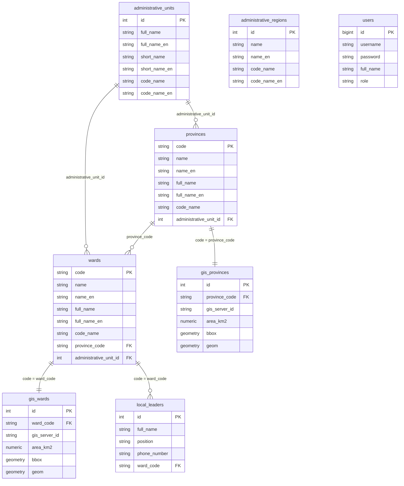

# Data Model Specification

This document is the authoritative reference for the database schema of the **Provincial Administrative Information Management and GIS Lookup System**, reverse-documented from the actual schema as created by `postgres_CreateSchema_CreateTables_vn_units.sql` and `postgresql_CreateGISTables.sql`.

It complements `ARCHITECTURE SPECIFICATION.md` (which describes _how_ modules are toggled) by defining exactly _what_ the core schema looks like, and establishes the pattern that future feature modules (`ocop`, `khcn`, `nonglam`) must follow.

---

## 1. Design Principle: Business Data vs. Spatial Data Separation

A key implementation decision — not explicit in the original architecture draft — is that **business/dictionary attributes and spatial (GIS) attributes are stored in separate tables**, joined 1:1 on the natural key (`code`):

| Business table (attributes, no geometry) | Spatial table (geometry only) | Join key                                       |
| :--------------------------------------- | :---------------------------- | :--------------------------------------------- |
| `provinces`                              | `gis_provinces`               | `provinces.code = gis_provinces.province_code` |
| `wards`                                  | `gis_wards`                   | `wards.code = gis_wards.ward_code`             |

**Rationale to preserve going forward:** this allows administrative lookups (search, dropdowns, name display) to run against small, geometry-free tables, while spatial queries and GeoJSON serialization hit only the `gis_*` tables. When adding a new **zone/polygon-type** feature module (e.g. `nonglam`), follow this same split (`nonglam_zones` + `gis_nonglam_zones`) if the module needs frequent non-spatial listing/search separate from map rendering. For simple **point-type** POI modules (e.g. `ocop`, `khcn`) a single table with an inline `geom` column is sufficient — see Section 4.

---

## 2. Entity-Relationship Diagram



> **Note on `administrative_regions`:** this table exists in the schema but **no other table currently has a foreign key to it**. Treat it as a reserved/unused dictionary (likely intended for future grouping such as "Tây Nguyên" region) rather than an active relationship. Do not assume `provinces` or `wards` are linked to it unless a migration explicitly adds that FK — and do not silently drop the table either, since it may already be relied on by seed/reference data tooling outside this repo.

---

## 3. Core Table Reference

### 3.1. `administrative_units`

Dictionary of Vietnamese administrative unit _types_ (e.g. Tỉnh, Thành phố, Phường, Xã) — not a specific province or ward.

| Column                        | Type           | Notes                 |
| :---------------------------- | :------------- | :-------------------- |
| `id`                          | `integer`      | PK                    |
| `full_name`, `full_name_en`   | `varchar(255)` | e.g. "Phường", "Ward" |
| `short_name`, `short_name_en` | `varchar(255)` |                       |
| `code_name`, `code_name_en`   | `varchar(255)` |                       |

Referenced by `provinces.administrative_unit_id` and `wards.administrative_unit_id`.

### 3.2. `administrative_regions`

Dictionary of geographic regions. **Currently unreferenced** — see note above.

| Column                      | Type           | Notes |
| :-------------------------- | :------------- | :---- |
| `id`                        | `integer`      | PK    |
| `name`, `name_en`           | `varchar(255)` |       |
| `code_name`, `code_name_en` | `varchar(255)` |       |

### 3.3. `provinces`

Business attributes for provinces (only province `52` — Gia Lai — is populated/relevant for this deployment).

| Column                      | Type           | Notes                                              |
| :-------------------------- | :------------- | :------------------------------------------------- |
| `code`                      | `varchar(20)`  | **PK** — natural key, national administrative code |
| `name`, `name_en`           | `varchar(255)` |                                                    |
| `full_name`, `full_name_en` | `varchar(255)` |                                                    |
| `code_name`                 | `varchar(255)` |                                                    |
| `administrative_unit_id`    | `integer`      | FK → `administrative_units.id`                     |

Index: `idx_provinces_unit` on `administrative_unit_id`.

### 3.4. `wards`

Business attributes for the 135 phường/xã/thị trấn under Gia Lai. **District/county level is intentionally not modeled** — `wards` links directly to `provinces`.

| Column                      | Type           | Notes                                 |
| :-------------------------- | :------------- | :------------------------------------ |
| `code`                      | `varchar(20)`  | **PK** — national administrative code |
| `name`, `name_en`           | `varchar(255)` |                                       |
| `full_name`, `full_name_en` | `varchar(255)` | e.g. "Phường Ia Kring"                |
| `code_name`                 | `varchar(255)` |                                       |
| `province_code`             | `varchar(20)`  | FK → `provinces.code`                 |
| `administrative_unit_id`    | `integer`      | FK → `administrative_units.id`        |

Indexes: `idx_wards_province` (`province_code`), `idx_wards_unit` (`administrative_unit_id`).

### 3.5. `gis_provinces`

Spatial data for provinces, 1:1 with `provinces` via `province_code`.

| Column          | Type               | Notes                                             |
| :-------------- | :----------------- | :------------------------------------------------ |
| `id`            | `integer identity` | PK (surrogate)                                    |
| `province_code` | `varchar(20)`      | FK → `provinces.code`, unique-in-practice (1:1)   |
| `gis_server_id` | `varchar(50)`      | External GIS server reference, if any             |
| `area_km2`      | `numeric(12,5)`    |                                                   |
| `bbox`          | `geometry`         | Bounding box, used for fast viewport/zoom queries |
| `geom`          | `geometry`         | Actual boundary (MultiPolygon)                    |

Indexes: `idx_gis_provinces_province_code` (btree), `idx_gis_provinces_bbox` (**GiST**), `idx_gis_provinces_geom` (**GiST**).

### 3.6. `gis_wards`

Spatial data for wards, 1:1 with `wards` via `ward_code`. Same column shape and indexing pattern as `gis_provinces` (see above), FK to `wards.code`.

### 3.7. `local_leaders`(For now, skip this step as there is no data.)

Leadership info per ward (e.g. Chủ tịch UBND) — implemented as its own table, **not** an inline attribute of `wards` as earlier high-level docs implied.

| Column         | Type               | Notes                          |
| :------------- | :----------------- | :----------------------------- |
| `id`           | `integer identity` | PK                             |
| `full_name`    | `varchar(255)`     | Required                       |
| `position`     | `varchar(100)`     | Required, e.g. "Chủ tịch UBND" |
| `phone_number` | `varchar(20)`      | Optional                       |
| `ward_code`    | `varchar(20)`      | FK → `wards.code`              |

A ward may have 0..N `local_leaders` rows (e.g. Chairman + Vice Chairman). API/DTO layers exposing ward details should join this table explicitly (see `API_CONTRACT.md` — `WardDetailDto` should be extended to include a `leaders` array; it currently does not).

### 3.8. `users`

Application accounts. Only two roles exist for the Core phase.

| Column      | Type              | Notes                                                                                                                       |
| :---------- | :---------------- | :-------------------------------------------------------------------------------------------------------------------------- |
| `id`        | `bigint identity` | PK                                                                                                                          |
| `username`  | `varchar(50)`     | Unique (`users_username_key`)                                                                                               |
| `password`  | `varchar(100)`    | **Stores a bcrypt hash, never plaintext.** 100 chars comfortably fits a bcrypt hash (~60 chars); do not shrink this column. |
| `full_name` | `varchar(100)`    |                                                                                                                             |
| `role`      | `varchar(20)`     | CHECK constraint restricts to `'ADMIN'` or `'VIEWER'` only                                                                  |

### 3.9. `spatial_ref_sys`

Standard PostGIS system table (spatial reference system definitions). Not application-specific — do not modify or treat as project schema; it is created automatically by `CREATE EXTENSION postgis`.

---

## 4. Convention for Future Feature Module Tables

When implementing `ocop`, `khcn`, or `nonglam` (per `ARCHITECTURE SPECIFICATION.md` Section 6.4), follow these patterns to stay consistent with the core schema above.

### 4.1. Point-type modules (`ocop`, `khcn`)

A single table is sufficient — no need to split business/spatial data, since each row already represents one point of interest with a small attribute set.

```sql
-- Example pattern for features/ocop
CREATE TABLE ocop_products (
    id integer GENERATED ALWAYS AS IDENTITY NOT NULL,
    name varchar(255) NOT NULL,
    product_type varchar(100),
    description text,
    ward_code varchar(20) NOT NULL,
    geom geometry(Point, 4326) NOT NULL,
    image_url varchar(500),
    PRIMARY KEY (id),
    CONSTRAINT ocop_products_ward_code_fkey FOREIGN KEY (ward_code) REFERENCES wards (code)
);

CREATE INDEX idx_ocop_products_ward_code ON public.ocop_products USING btree (ward_code);
CREATE INDEX idx_ocop_products_geom ON public.ocop_products USING gist (geom);
```

`khcn_units` should follow the identical shape (table/column names swapped for the domain).

### 4.2. Zone/polygon-type modules (`nonglam`)

Because zone data is more likely to need non-spatial listing (e.g. a table view of all zones with area, type, without a map), consider mirroring the core split pattern:

```sql
CREATE TABLE nonglam_zones (
    id integer GENERATED ALWAYS AS IDENTITY NOT NULL,
    zone_name varchar(255) NOT NULL,
    zone_type varchar(100),
    ward_code varchar(20) NOT NULL,
    PRIMARY KEY (id),
    CONSTRAINT nonglam_zones_ward_code_fkey FOREIGN KEY (ward_code) REFERENCES wards (code)
);

CREATE TABLE gis_nonglam_zones (
    id integer GENERATED ALWAYS AS IDENTITY NOT NULL,
    zone_id integer NOT NULL,
    area_km2 numeric(12, 5),
    geom geometry(MultiPolygon, 4326) NOT NULL,
    PRIMARY KEY (id),
    CONSTRAINT gis_nonglam_zones_zone_id_fkey FOREIGN KEY (zone_id) REFERENCES nonglam_zones (id)
);

CREATE INDEX idx_gis_nonglam_zones_geom ON public.gis_nonglam_zones USING gist (geom);
```

This is a recommendation, not a hard requirement — if `nonglam` turns out to need only map display with no separate tabular view, a single table with an inline `geometry(MultiPolygon, 4326)` column (matching the `ocop_products` simplicity) is acceptable too. Pick the split only if a real non-spatial listing requirement exists; don't split preemptively.

### 4.3. Migration placement

All of the above are new **feature** migrations, not core migrations — they belong in `db/migration/ocop/`, `db/migration/khcn/`, `db/migration/nonglam/` respectively (per `ARCHITECTURE SPECIFICATION.md` Section 5.1), never in `db/migration/core/`.

---

## 5. Cross-References

- Compile-time toggling of the entities/repositories built on this schema: `ARCHITECTURE SPECIFICATION.md`, Sections 4–5.
- Per-customer database isolation (each customer gets their own copy of this schema plus their one enabled feature module): `ARCHITECTURE SPECIFICATION.md` Section 6, `DEPLOYMENT & FLEET STRATEGY.md`.
- API shapes built on top of these tables: `API_CONTRACT.md`.
- Entity/DTO/Mapper naming conventions: `CODING_CONVENTIONS.md`.
