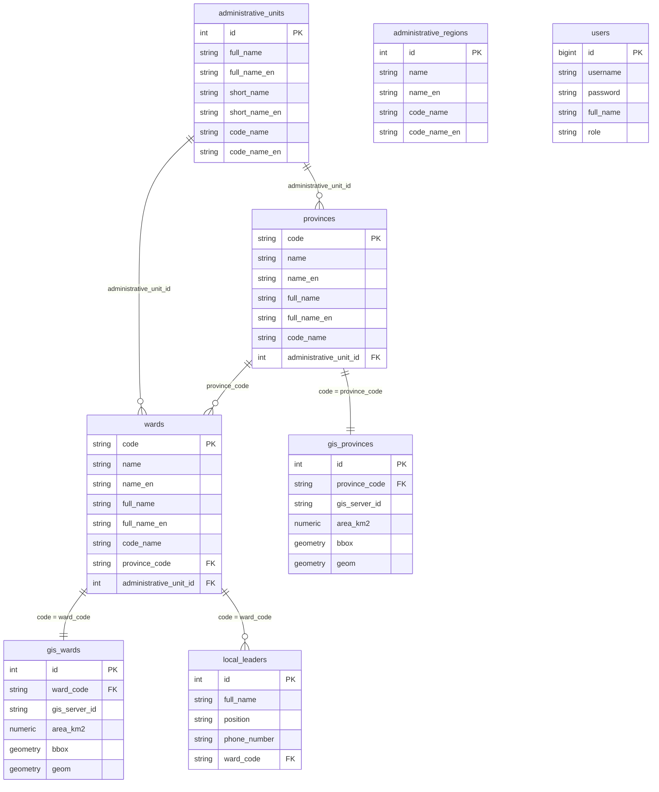

# Data Model Specification

This document is the authoritative reference for the database schema of the **Provincial Administrative Information Management and GIS Lookup System**, reverse-documented from the actual schema as created by `postgres_CreateSchema_CreateTables_vn_units.sql` and `postgresql_CreateGISTables.sql`.

It complements `ARCHITECTURE SPECIFICATION.md` (which describes _how_ modules are toggled) by defining exactly _what_ the core schema looks like, and establishes the pattern that future feature modules (`ocop`, `science`, `agriculture`) must follow.

---

## 1. Design Principle: Business Data vs. Spatial Data Separation

A key implementation decision — not explicit in the original architecture draft — is that **business/dictionary attributes and spatial (GIS) attributes are stored in separate tables**, joined 1:1 on the natural key (`code`):

| Business table (attributes, no geometry) | Spatial table (geometry only) | Join key                                       |
| :--------------------------------------- | :---------------------------- | :--------------------------------------------- |
| `provinces`                              | `gis_provinces`               | `provinces.code = gis_provinces.province_code` |
| `wards`                                  | `gis_wards`                   | `wards.code = gis_wards.ward_code`             |

**Rationale to preserve going forward:** this allows administrative lookups (search, dropdowns, name display) to run against small, geometry-free tables, while spatial queries and GeoJSON serialization hit only the `gis_*` tables. For specialized feature modules (`ocop`, `science`, `agriculture`), which are all **point-type** POI modules, a single table with an inline `geom geometry(Point, 4326)` column is sufficient — see Section 4.

---

## 2. Entity-Relationship Diagram


```mermaid
erDiagram
    administrative_units ||--o{ provinces : "administrative_unit_id"
    administrative_units ||--o{ wards : "administrative_unit_id"
    provinces ||--o{ wards : "province_code"
    provinces ||--|| gis_provinces : "code = province_code"
    wards ||--|| gis_wards : "code = ward_code"
    wards ||--o{ local_leaders : "code = ward_code"
    administrative_regions {
        int id PK
        string name
        string name_en
        string code_name
        string code_name_en
    }

    administrative_units {
        int id PK
        string full_name
        string full_name_en
        string short_name
        string short_name_en
        string code_name
        string code_name_en
    }

    provinces {
        string code PK
        string name
        string name_en
        string full_name
        string full_name_en
        string code_name
        int administrative_unit_id FK
    }

    wards {
        string code PK
        string name
        string name_en
        string full_name
        string full_name_en
        string code_name
        string province_code FK
        int administrative_unit_id FK
    }

    gis_provinces {
        int id PK
        string province_code FK
        string gis_server_id
        numeric area_km2
        geometry bbox
        geometry geom
    }

    gis_wards {
        int id PK
        string ward_code FK
        string gis_server_id
        numeric area_km2
        geometry bbox
        geometry geom
    }

    local_leaders {
        int id PK
        string full_name
        string position
        string phone_number
        string ward_code FK
    }

    users {
        bigint id PK
        string username
        string password
        string full_name
        string role
    }
```

> **Note on `administrative_regions`:** this table exists in the schema but **no other table currently has a foreign key to it**. Treat it as a reserved/unused dictionary (likely intended for future grouping such as "Tây Nguyên" region) rather than an active relationship. Do not assume `provinces` or `wards` are linked to it unless a migration explicitly adds that FK — and do not silently drop the table either, since it may already be relied on by seed/reference data tooling outside this repo.

---

## 3. Core Table Reference

### 3.1. `administrative_units`

Dictionary of Vietnamese administrative unit _types_ (e.g. Tỉnh, Thành phố, Phường, Xã) — not a specific province or ward.

| Column                        | Type           | Notes                 |
| :---------------------------- | :------------- | :-------------------- |
| `id`                          | `integer`      | PK                    |
| `full_name`, `full_name_en`   | `varchar(255)` | e.g. "Phường", "Ward" |
| `short_name`, `short_name_en` | `varchar(255)` |                       |
| `code_name`, `code_name_en`   | `varchar(255)` |                       |

Referenced by `provinces.administrative_unit_id` and `wards.administrative_unit_id`.

### 3.2. `administrative_regions`

Dictionary of geographic regions. **Currently unreferenced** — see note above.

| Column                      | Type           | Notes |
| :-------------------------- | :------------- | :---- |
| `id`                        | `integer`      | PK    |
| `name`, `name_en`           | `varchar(255)` |       |
| `code_name`, `code_name_en` | `varchar(255)` |       |

### 3.3. `provinces`

Business attributes for provinces (only province `52` — Gia Lai — is populated/relevant for this deployment).

| Column                      | Type           | Notes                                              |
| :-------------------------- | :------------- | :------------------------------------------------- |
| `code`                      | `varchar(20)`  | **PK** — natural key, national administrative code |
| `name`, `name_en`           | `varchar(255)` |                                                    |
| `full_name`, `full_name_en` | `varchar(255)` |                                                    |
| `code_name`                 | `varchar(255)` |                                                    |
| `administrative_unit_id`    | `integer`      | FK → `administrative_units.id`                     |

Index: `idx_provinces_unit` on `administrative_unit_id`.

### 3.4. `wards`

Business attributes for the 135 phường/xã/thị trấn under Gia Lai. **District/county level is intentionally not modeled** — `wards` links directly to `provinces`.

| Column                      | Type           | Notes                                 |
| :-------------------------- | :------------- | :------------------------------------ |
| `code`                      | `varchar(20)`  | **PK** — national administrative code |
| `name`, `name_en`           | `varchar(255)` |                                       |
| `full_name`, `full_name_en` | `varchar(255)` | e.g. "Phường Ia Kring"                |
| `code_name`                 | `varchar(255)` |                                       |
| `province_code`             | `varchar(20)`  | FK → `provinces.code`                 |
| `administrative_unit_id`    | `integer`      | FK → `administrative_units.id`        |

Indexes: `idx_wards_province` (`province_code`), `idx_wards_unit` (`administrative_unit_id`).

### 3.5. `gis_provinces`

Spatial data for provinces, 1:1 with `provinces` via `province_code`.

| Column          | Type               | Notes                                             |
| :-------------- | :----------------- | :------------------------------------------------ |
| `id`            | `integer identity` | PK (surrogate)                                    |
| `province_code` | `varchar(20)`      | FK → `provinces.code`, unique-in-practice (1:1)   |
| `gis_server_id` | `varchar(50)`      | External GIS server reference, if any             |
| `area_km2`      | `numeric(12,5)`    |                                                   |
| `bbox`          | `geometry`         | Bounding box, used for fast viewport/zoom queries |
| `geom`          | `geometry`         | Actual boundary (MultiPolygon)                    |

Indexes: `idx_gis_provinces_province_code` (btree), `idx_gis_provinces_bbox` (**GiST**), `idx_gis_provinces_geom` (**GiST**).

### 3.6. `gis_wards`

Spatial data for wards, 1:1 with `wards` via `ward_code`. Same column shape and indexing pattern as `gis_provinces` (see above), FK to `wards.code`.

### 3.7. `local_leaders`

Leadership info per ward (e.g. Chủ tịch UBND, Phó Chủ tịch). Implemented as its own table, **not** an inline attribute of `wards`.

| Column         | Type               | Notes                          |
| :------------- | :----------------- | :----------------------------- |
| `id`           | `integer identity` | PK                             |
| `full_name`    | `varchar(255)`     | Required                       |
| `position`     | `varchar(100)`     | Required, e.g. "Chủ tịch"      |
| `phone_number` | `varchar(20)`      | Optional                       |
| `ward_code`    | `varchar(20)`      | FK → `wards.code`              |

> **Note on Data Ingestion:** The table structure and backend mapping are fully ready. Currently, no cadre data is populated (`local_leaders` has 0 rows, returning `[]` in `GET /api/wards/{code}`). Whenever data is inserted into `local_leaders`, the frontend will immediately display the leadership info without requiring any code modifications.

### 3.8. `users`

Application accounts. Only two roles exist for the Core phase.

| Column      | Type              | Notes                                                                                                                       |
| :---------- | :---------------- | :-------------------------------------------------------------------------------------------------------------------------- |
| `id`        | `bigint identity` | PK                                                                                                                          |
| `username`  | `varchar(50)`     | Unique (`users_username_key`)                                                                                               |
| `password`  | `varchar(100)`    | **Stores a bcrypt hash, never plaintext.** 100 chars comfortably fits a bcrypt hash (~60 chars); do not shrink this column. |
| `full_name` | `varchar(100)`    |                                                                                                                             |
| `role`      | `varchar(20)`     | CHECK constraint restricts to `'ADMIN'` or `'VIEWER'` only                                                                  |

### 3.9. `spatial_ref_sys`

Standard PostGIS system table (spatial reference system definitions). Created automatically by `CREATE EXTENSION postgis`.

---

## 4. Convention for Future Feature Module Tables

All 3 feature modules (`ocop`, `science`, `agriculture`) are **point-type POI modules**. A single table with an inline PostGIS Point geometry (`geom geometry(Point, 4326)`) is used for each module, keeping the architecture clean and consistent:

### 4.1. Point-type Module Pattern

```sql
-- 1. Example schema for features/ocop
CREATE TABLE ocop_products (
    id integer GENERATED ALWAYS AS IDENTITY NOT NULL,
    name varchar(255) NOT NULL,
    product_type varchar(100),
    description text,
    ward_code varchar(20) NOT NULL,
    geom geometry(Point, 4326) NOT NULL,
    image_url varchar(500),
    PRIMARY KEY (id),
    CONSTRAINT ocop_products_ward_code_fkey FOREIGN KEY (ward_code) REFERENCES wards (code)
);
CREATE INDEX idx_ocop_products_ward_code ON public.ocop_products USING btree (ward_code);
CREATE INDEX idx_ocop_products_geom ON public.ocop_products USING gist (geom);

-- 2. Schema for features/science (identical shape)
CREATE TABLE science_units (
    id integer GENERATED ALWAYS AS IDENTITY NOT NULL,
    name varchar(255) NOT NULL,
    unit_type varchar(100),
    description text,
    ward_code varchar(20) NOT NULL,
    geom geometry(Point, 4326) NOT NULL,
    image_url varchar(500),
    PRIMARY KEY (id),
    CONSTRAINT science_units_ward_code_fkey FOREIGN KEY (ward_code) REFERENCES wards (code)
);
CREATE INDEX idx_science_units_ward_code ON public.science_units USING btree (ward_code);
CREATE INDEX idx_science_units_geom ON public.science_units USING gist (geom);

-- 3. Schema for features/agriculture (identical shape)
CREATE TABLE agriculture_units (
    id integer GENERATED ALWAYS AS IDENTITY NOT NULL,
    name varchar(255) NOT NULL,
    unit_type varchar(100),
    description text,
    ward_code varchar(20) NOT NULL,
    geom geometry(Point, 4326) NOT NULL,
    image_url varchar(500),
    PRIMARY KEY (id),
    CONSTRAINT agriculture_units_ward_code_fkey FOREIGN KEY (ward_code) REFERENCES wards (code)
);
CREATE INDEX idx_agriculture_units_ward_code ON public.agriculture_units USING btree (ward_code);
CREATE INDEX idx_agriculture_units_geom ON public.agriculture_units USING gist (geom);
```

### 4.2. Migration Placement

All feature migrations belong to their dedicated folders:
- `BE/src/main/resources/db/migration/ocop/`
- `BE/src/main/resources/db/migration/science/`
- `BE/src/main/resources/db/migration/agriculture/`

Never place feature tables into `db/migration/core/`.

---

## 5. Cross-References

- Compile-time toggling of the entities/repositories built on this schema: `ARCHITECTURE SPECIFICATION.md`, Sections 4–5.
- Per-customer database isolation (each customer gets their own copy of this schema plus their one enabled feature module): `ARCHITECTURE SPECIFICATION.md` Section 6, `DEPLOYMENT & FLEET STRATEGY.md`.
- API shapes built on top of these tables: `API_CONTRACT.md`.
- Entity/DTO/Mapper naming conventions: `CODING_CONVENTIONS.md`.
