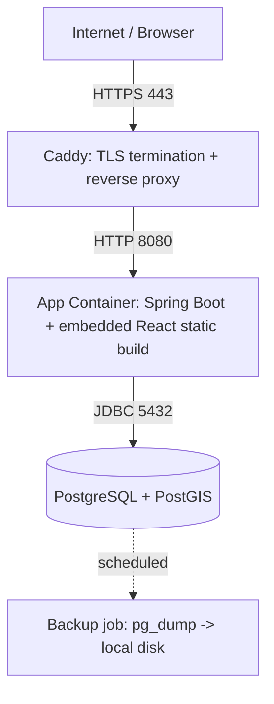

# Deployment & Fleet Strategy

This document defines the operational deployment model for the **Provincial Administrative Information Management and GIS Lookup System**: how it is hosted today, and how hosting is expected to evolve as the number of deployed instances grows.

It complements `ARCHITECTURE SPECIFICATION.md` (Sections 6–7), which defines the **isolation model** (why each customer gets its own app + own database). This document defines the **operational runbook**: what actually runs on the server, how it's built, deployed, backed up, and rolled back.

> **Status note (2026-07):** the project currently has exactly **one tenant** (Gia Lai province, code `52`). There is no live fleet yet. Sections 1–5 below describe the deployment that exists _now_. Section 6 describes the _trigger and plan_ for when a second instance is onboarded — it is a decision already made, not something already built.

---

## 1. Current Deployment Model (Single Tenant)

| Aspect             | Decision                                                                                                                             |
| :----------------- | :----------------------------------------------------------------------------------------------------------------------------------- |
| **Hosting**        | Rented VPS, domestic cloud provider — **Viettel IDC** (per `PROJECT_OVERVIEW.md` Section 1's data-sovereignty requirement).          |
| **OS**             | Ubuntu Server (LTS).                                                                                                                 |
| **Orchestration**  | Plain **Docker Compose**. No Kubernetes, no PaaS layer, no fleet automation — deliberately, since there is only one instance to run. |
| **Process count**  | One `docker compose` stack: app container + PostgreSQL/PostGIS container + a lightweight reverse proxy for TLS.                      |
| **Deploy trigger** | Manual: SSH in, `git pull`, rebuild, `docker compose up -d`. See Section 5.1.                                                        |

This section intentionally does **not** introduce a fleet registry, multi-instance rollout scripts, or `tenant_id`-based multi-tenancy. Building that machinery now, for one customer, would be premature — see Section 6 for what actually happens when a second customer arrives.

---

## 2. Container Architecture



- **App container:** a single Spring Boot fat JAR that serves both the REST API (`/api/**`) and the built React static assets (per `PROJECT_OVERVIEW.md` Section 3.4 — "no separate Nginx required"). Built as a multi-stage Docker image (Section 4).
- **DB container:** `postgis/postgis` image, one instance, one database (`gialai`), data on a named Docker volume.
- **Reverse proxy:** **Caddy** (not Nginx), chosen for automatic Let's Encrypt certificate issuance/renewal with near-zero configuration — appropriate for a single-developer operational load. This is the one process that talks to the outside world; the app container is not exposed directly.

---

## 3. Dockerfile (Multi-Stage Build)

The frontend and backend are built into a **single runtime image** so that the deployed artifact matches the "Spring Boot App with embedded React" model already committed to in `PROJECT_OVERVIEW.md` Section 3.4.

```dockerfile
# syntax=docker/dockerfile:1

# ---- Stage 1: Build Frontend (Vite/React) ----
FROM node:20-alpine AS fe-build
WORKDIR /fe
RUN corepack enable
COPY FE/package.json FE/pnpm-lock.yaml ./
RUN pnpm install --frozen-lockfile
COPY FE/ .
RUN pnpm build
# Output: /fe/dist

# ---- Stage 2: Build Backend (Spring Boot) + embed FE assets ----
FROM maven:3.9-eclipse-temurin-17 AS be-build
WORKDIR /be
COPY BE/pom.xml ./
COPY BE/.mvn .mvn
COPY BE/mvnw ./
RUN ./mvnw -B dependency:go-offline
COPY BE/src ./src
# Embed the built React assets as Spring Boot static resources
COPY --from=fe-build /fe/dist ./src/main/resources/static
RUN ./mvnw -B clean package -DskipTests

# ---- Stage 3: Runtime ----
FROM eclipse-temurin:17-jre-alpine
RUN addgroup -S gis && adduser -S gis -G gis
WORKDIR /app
COPY --from=be-build /be/target/*.jar app.jar
USER gis
EXPOSE 8080
ENTRYPOINT ["java", "-jar", "app.jar"]
```

> **Implementation note:** as of this writing, `BE/pom.xml` has no frontend-embedding wiring yet, and `application.properties` is not committed (it's gitignored — see `DEVELOPMENT_SETUP.md`). Wiring this Dockerfile in is a **Phase 2 prerequisite task**, not yet done. Track it alongside the Docker Compose rollout below.

---

## 4. Docker Compose Stack

### 4.1. `docker-compose.yml`

```yaml
services:
  app:
    build:
      context: .
      dockerfile: Dockerfile
    image: gialai-gis-app:latest
    container_name: gialai-gis-app
    restart: unless-stopped
    env_file:
      - .env
    depends_on:
      db:
        condition: service_healthy
    networks:
      - gis-net
    # No published port on the host — only Caddy talks to this container.

  db:
    image: postgis/postgis:15-3.4-alpine
    container_name: gialai-gis-db
    restart: unless-stopped
    environment:
      POSTGRES_DB: ${POSTGRES_DB:-gialai}
      POSTGRES_USER: ${POSTGRES_USER}
      POSTGRES_PASSWORD: ${POSTGRES_PASSWORD}
    volumes:
      - db-data:/var/lib/postgresql/data
    healthcheck:
      test:
        [
          "CMD-SHELL",
          "pg_isready -U ${POSTGRES_USER} -d ${POSTGRES_DB:-gialai}",
        ]
      interval: 10s
      timeout: 5s
      retries: 5
    networks:
      - gis-net
    # No published port on the host — only the app container reaches Postgres,
    # over the internal Docker network. Use `docker compose exec db psql ...`
    # for manual access instead of exposing 5432 publicly.

  caddy:
    image: caddy:2-alpine
    container_name: gialai-gis-proxy
    restart: unless-stopped
    ports:
      - "80:80"
      - "443:443"
    volumes:
      - ./Caddyfile:/etc/caddy/Caddyfile:ro
      - caddy-data:/data
      - caddy-config:/config
    depends_on:
      - app
    networks:
      - gis-net

volumes:
  db-data:
  caddy-data:
  caddy-config:

networks:
  gis-net:
    driver: bridge
```

### 4.2. `Caddyfile`

```
gis.gialai.gov.vn {
    reverse_proxy app:8080
}
```

_(Replace with the real domain once assigned. Caddy handles ACME/Let's Encrypt automatically — no manual certbot step required.)_

### 4.3. `.env` (not committed — see `.env.example` below)

```env
# --- Database credentials ---
POSTGRES_DB=gialai
POSTGRES_USER=gis_admin
POSTGRES_PASSWORD=CHANGE_ME_STRONG_PASSWORD

# --- Spring datasource (Spring Boot relaxed-binding maps these
#     env vars directly onto spring.datasource.* properties —
#     no application.properties file is required inside the container) ---
SPRING_DATASOURCE_URL=jdbc:postgresql://db:5432/gialai
SPRING_DATASOURCE_USERNAME=gis_admin
SPRING_DATASOURCE_PASSWORD=CHANGE_ME_STRONG_PASSWORD

# --- JWT ---
JWT_SECRET=CHANGE_ME_LONG_RANDOM_STRING
JWT_EXPIRATION_MS=86400000

# --- Feature flags (all false for Phase 1 — see ARCHITECTURE SPECIFICATION.md Section 4.3) ---
ENABLE_OCOP=false
ENABLE_SCIENCE=false
ENABLE_AGRICULTURE=false
```

A `.env.example` (with placeholder values, no real secrets) should be committed to the repo so a fresh VPS setup has something to copy from — this closes the same gap flagged for local dev's missing `application.properties` template.

---

## 5. Standard Operating Runbooks

### 5.1. Deploying an Update

```bash
cd /opt/gialai-gis
git pull origin main
docker compose build app
docker compose up -d app
docker compose logs -f app   # confirm clean startup + Flyway migration success
```

Expect a brief downtime (seconds) while the app container restarts; `db` and `caddy` are untouched. This is acceptable for the current single-tenant, low-traffic phase. Zero-downtime rollout is a Section 6 concern (PaaS-managed rolling deploys), not something to hand-build now.

### 5.2. Emergency Rollback

```bash
# Previous image tags are retained locally (do not prune aggressively):
docker images gialai-gis-app
docker tag gialai-gis-app:<previous-good-tag> gialai-gis-app:latest
docker compose up -d app
```

If the previous release included a Flyway migration that must also be reverted, do **not** hand-edit the database — write and apply a new forward-only "undo" migration instead (Flyway migrations are never edited or deleted once applied to a database that has run them; see `CODING_CONVENTIONS.md`).

### 5.3. Database Backup

Daily `pg_dump`, run from the host via cron (kept outside the app container so it survives app redeploys):

```bash
#!/usr/bin/env bash
# /opt/gialai-gis/scripts/backup-db.sh
set -euo pipefail
STAMP=$(date +%Y%m%d_%H%M%S)
BACKUP_DIR=/opt/gialai-gis/backups
mkdir -p "$BACKUP_DIR"

docker compose exec -T db pg_dump -U "$POSTGRES_USER" -Fc "$POSTGRES_DB" \
    > "$BACKUP_DIR/gialai_${STAMP}.dump"

# Retention: keep 7 daily + 4 weekly (Sunday) backups
find "$BACKUP_DIR" -name "gialai_*.dump" -mtime +7 ! -name "*_Sun_*" -delete
```

```cron
# crontab -e
0 2 * * * /opt/gialai-gis/scripts/backup-db.sh >> /var/log/gialai-backup.log 2>&1
```

**Restore:**

```bash
docker compose exec -T db pg_restore -U "$POSTGRES_USER" -d "$POSTGRES_DB" --clean --if-exists \
    < /opt/gialai-gis/backups/gialai_20260714_020000.dump
```

Off-VPS copies of backups (e.g. synced to a separate object storage bucket or a second VPS) are a Phase 2 hardening task — not yet in place; flag this as an open risk until it is.

### 5.4. First-Time VPS Setup Checklist

- [ ] Provision Ubuntu Server VPS on Viettel IDC; assign static IP + DNS A record.
- [ ] Install Docker Engine + Docker Compose plugin.
- [ ] `git clone` the repo to `/opt/gialai-gis`.
- [ ] Copy `.env.example` → `.env`, fill in real secrets (generate `JWT_SECRET` with e.g. `openssl rand -hex 32`).
- [ ] Point the domain's DNS at the VPS; confirm ports 80/443 are open in the VPS firewall/security group.
- [ ] `docker compose up -d --build`; confirm Caddy issues a certificate and `/actuator/health` responds `UP` through HTTPS.
- [ ] Log in with the seeded `admin` account and **change its password immediately** (the seeded `123456` password from `DatabaseSeeder` is for local dev only — never leave it active on a public deployment).
- [ ] Install the cron job from Section 5.3.

---

## 6. Future: Multi-Instance Scaling Path

This section is **forward-looking policy**, agreed now so that the isolation model in `ARCHITECTURE SPECIFICATION.md` Section 6 isn't compromised later under time pressure. Nothing in this section is built yet.

### 6.1. Trigger

Re-evaluate hosting approach when a **second** paying customer/instance is onboarded (i.e. as soon as "single tenant" stops being true). Until then, Section 1–5 above is the entire operational model — do not build fleet tooling speculatively.

### 6.2. Decision: adopt a self-hosted PaaS, don't hand-roll fleet scripts

When that trigger is hit, the plan is to adopt an existing self-hosted PaaS — **Dokploy** or **Coolify** — rather than building custom fleet automation (a bespoke `ops/fleet.yaml` registry + hand-written `deploy.sh` rollout script). Rationale:

- Both are open-source, self-hostable on the same class of VPS this project already targets (no dependency on a foreign paid cloud API, preserving the data-sovereignty requirement in `PROJECT_OVERVIEW.md` Section 1).
- Both deploy **Docker Compose stacks directly** — the exact artifact this project already produces (Section 4.1) — so there is no rewrite of the app packaging to adopt one.
- Both provide, out of the box, the operational pieces this document would otherwise have to hand-build per new customer: Git-push-to-deploy, per-app environment variable management, automatic reverse proxy + TLS (Traefik-based), and basic resource/log monitoring.
- Both support running **multiple isolated projects on one or more servers** from a single control panel — which maps directly onto the database-per-customer model: **one Dokploy/Coolify "project" = one customer**, with its own Compose stack, its own `.env`, and its own PostgreSQL/PostGIS container. No shared database, no `tenant_id` column, no code change required to onboard a customer this way.
- Multi-server fleet management (running several VPS hosts under one control panel) is supported by both tools if/when a single VPS is no longer enough — Dokploy via Docker Swarm, Coolify via its multi-server mode — so this decision also covers horizontal growth, not just "more customers on one box."

**Choosing between Dokploy and Coolify is deferred** until the trigger is actually hit — both are moving fast and the better fit depends on the team's size and comfort with their respective stacks at that time. Re-check each project's current documentation before committing; do not rely on this document for their exact feature set.

### 6.3. What onboarding a customer looks like under this plan

1. Create a new project in the PaaS control panel.
2. Point it at this repository, same as today's manual `git pull` (Section 5.1) — the PaaS handles the build via the same `Dockerfile`/`docker-compose.yml` in Sections 3–4.
3. Configure that project's own `.env` — most importantly, that customer's own `ENABLE_OCOP` / `ENABLE_SCIENCE` / `ENABLE_AGRICULTURE` flags (`ARCHITECTURE SPECIFICATION.md` Section 4.3) and its own database credentials.
4. The PaaS provisions/starts a **dedicated** database container for that project — satisfying the "database-per-customer" isolation decision in `ARCHITECTURE SPECIFICATION.md` Section 6 without any additional code.
5. Assign the customer's subdomain/domain; the PaaS's built-in reverse proxy issues its own TLS certificate — Caddy (Section 4.2) is superseded by the PaaS's proxy at that point.

### 6.4. What this section deliberately does _not_ commit to

The earlier planning note in `PLAN-gis-modularity.md` (Task 4) sketched a bespoke `ops/fleet.yaml` registry and `ops/deploy.sh` rollout script. That plan is **superseded** by the decision in Section 6.2 above: adopt existing PaaS tooling instead of building and maintaining custom fleet scripts. `PLAN-gis-modularity.md` should be treated as historical planning context, not a current requirement.

---

## 7. Cross-References

- [Project Overview & Requirement Specs](./PROJECT_OVERVIEW.md)
- [Architecture Specification (modularity + isolation model)](./ARCHITECTURE%20SPECIFICATION.md) — Sections 6–7
- [Data Model Specification](./DATA_MODEL.md)
- [API Contract](./API_CONTRACT.md)
- [Coding Conventions & Standards](./CODING_CONVENTIONS.md)
- [Local Development Setup Guide](./DEVELOPMENT_SETUP.md) — for local dev without Docker
