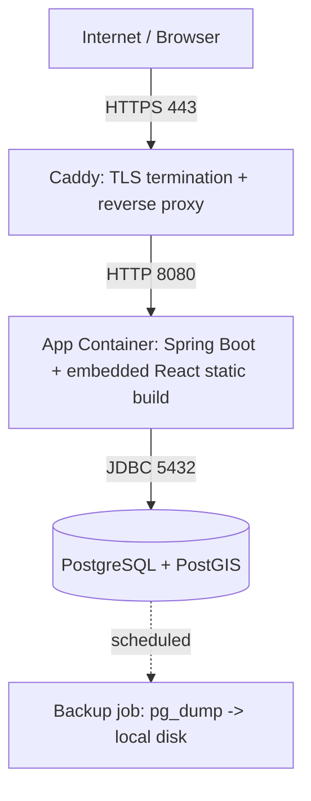

# Deployment & Fleet Strategy

This document defines the operational deployment model for the **Provincial Administrative Information Management and GIS Lookup System**: how it is hosted today, and how hosting is structured for multi-customer deployments.

It complements `ARCHITECTURE SPECIFICATION.md` (Sections 6–7), which defines the **isolation model** (why each customer gets its own app + own database). This document defines the **operational runbook**: what actually runs on the server, how it's built, deployed, backed up, and rolled back.

---

## 1. Current Deployment Model (Single VPS, Multi-Stack)

| Aspect             | Decision                                                                                                                             |
| :----------------- | :----------------------------------------------------------------------------------------------------------------------------------- |
| **Hosting**        | Rented VPS, domestic cloud provider — **Viettel IDC** (per `PROJECT_OVERVIEW.md` Section 1's data-sovereignty requirement).          |
| **OS**             | Ubuntu Server (LTS).                                                                                                                 |
| **Orchestration**  | Plain **Docker Compose**.                                                                                                            |
| **Architecture**   | 1 VPS hosting 3 isolated customer stacks (`gialai_ocop`, `gialai_science`, `gialai_agriculture`) + Caddy reverse proxy for TLS.     |
| **Deploy trigger** | Git-based build / CI-CD or manual: SSH in, `git pull`, rebuild, `docker compose up -d`.                                               |

---

## 2. Container Architecture


```mermaid
graph TD
    Internet[Internet / Browser]
    Proxy[Caddy: TLS termination + reverse proxy]
    App[App Container: Spring Boot + embedded React static build]
    DB[(PostgreSQL + PostGIS)]
    Backup[Backup job: pg_dump -> local disk]

    Internet -->|HTTPS 443| Proxy
    Proxy -->|HTTP 8080| App
    App -->|JDBC 5432| DB
    DB -.->|scheduled| Backup
```

- **App container:** a single Spring Boot fat JAR that serves both the REST API (`/api/**`) and the built React static assets (per `PROJECT_OVERVIEW.md` Section 3.4 — "no separate Nginx required"). Built as a multi-stage Docker image (Section 3).
- **DB container:** `postgis/postgis` image, dedicated database per customer, data on a named Docker volume.
- **Reverse proxy:** **Caddy** (not Nginx), chosen for automatic Let's Encrypt certificate issuance/renewal with near-zero configuration.

---

## 3. Dockerfile (Multi-Stage Build)

The frontend and backend are built into a **single runtime image** so that the deployed artifact matches the "Spring Boot App with embedded React" model already committed to in `PROJECT_OVERVIEW.md` Section 3.4.

```dockerfile
# syntax=docker/dockerfile:1
#
# Multi-stage build theo đúng mô hình đã chốt trong
# docs/en/DEPLOYMENT & FLEET STRATEGY.md (Section 3): FE + BE build thành DUY NHẤT
# 1 image runtime - Spring Boot phục vụ luôn cả /api/** lẫn static assets của React
# ("no separate Nginx required" - xem PROJECT_OVERVIEW.md Section 3.4).

# ---- Stage 1: Build Frontend (Vite/React) ----
FROM node:20-alpine AS fe-build
WORKDIR /fe
RUN corepack enable
# Pin cứng version pnpm theo đúng lockfileVersion đang dùng (pnpm-lock.yaml hiện tại
# là lockfileVersion 9.0) thay vì chỉ "corepack enable" suông - corepack không tự biết
# version nào nếu package.json không có field "packageManager", có thể fetch nhầm
# major version pnpm khác gây lệch lockfile.
RUN corepack prepare pnpm@9 --activate
COPY FE/package.json FE/pnpm-lock.yaml ./
RUN pnpm install --frozen-lockfile
COPY FE/ .
RUN pnpm build
# Output: /fe/dist

# ---- Stage 2: Build Backend (Spring Boot) + embed FE assets ----
FROM maven:3.9-eclipse-temurin-17 AS be-build
WORKDIR /be
COPY BE/pom.xml ./
COPY BE/.mvn .mvn
COPY BE/mvnw ./
# Defensive chmod: mvnw cần bit thực thi. Repo đã fix ở mức git (100755), nhưng một số
# cách lấy source (vd. giải nén từ zip GitHub "Download ZIP" thay vì git clone) không
# giữ lại execute bit, nên chmod lại ở đây cho chắc thay vì phụ thuộc hoàn toàn vào
# git mode.
RUN chmod +x mvnw
RUN ./mvnw -B dependency:go-offline
COPY BE/src ./src
# Embed the built React assets as Spring Boot static resources
COPY --from=fe-build /fe/dist ./src/main/resources/static
RUN ./mvnw -B clean package -DskipTests

# ---- Stage 3: Runtime ----
FROM eclipse-temurin:17-jre-alpine
RUN addgroup -S gis && adduser -S gis -G gis
WORKDIR /app
COPY --from=be-build /be/target/*.jar app.jar
USER gis
EXPOSE 8080
ENTRYPOINT ["java", "-jar", "app.jar"]
```

---

## 4. Docker Compose Stack

### 4.1. `docker-compose.yml`

```yaml
services:
  app:
    build:
      context: .
      dockerfile: Dockerfile
    image: gialai-gis-app:latest
    container_name: gialai-gis-app
    restart: unless-stopped
    env_file:
      - .env
    depends_on:
      db:
        condition: service_healthy
    networks:
      - gis-net

  db:
    image: postgis/postgis:15-3.4-alpine
    container_name: gialai-gis-db
    restart: unless-stopped
    environment:
      POSTGRES_DB: ${POSTGRES_DB:-gialai}
      POSTGRES_USER: ${POSTGRES_USER}
      POSTGRES_PASSWORD: ${POSTGRES_PASSWORD}
    volumes:
      - db-data:/var/lib/postgresql/data
    healthcheck:
      test:
        [
          "CMD-SHELL",
          "pg_isready -U ${POSTGRES_USER} -d ${POSTGRES_DB:-gialai}",
        ]
      interval: 10s
      timeout: 5s
      retries: 5
    networks:
      - gis-net

  caddy:
    image: caddy:2-alpine
    container_name: gialai-gis-proxy
    restart: unless-stopped
    ports:
      - "80:80"
      - "443:443"
    volumes:
      - ./Caddyfile:/etc/caddy/Caddyfile:ro
      - caddy-data:/data
      - caddy-config:/config
    depends_on:
      - app
    networks:
      - gis-net

volumes:
  db-data:
  caddy-data:
  caddy-config:

networks:
  gis-net:
    driver: bridge
```

### 4.2. `Caddyfile`

```
gis.gialai.gov.vn {
    reverse_proxy app:8080
}
```

### 4.3. `.env` (not committed — see `.env.example` below)

```env
# --- Database credentials ---
POSTGRES_DB=gialai
POSTGRES_USER=gis_admin
POSTGRES_PASSWORD=CHANGE_ME_STRONG_PASSWORD

# --- Spring datasource ---
SPRING_DATASOURCE_URL=jdbc:postgresql://db:5432/gialai
SPRING_DATASOURCE_USERNAME=gis_admin
SPRING_DATASOURCE_PASSWORD=CHANGE_ME_STRONG_PASSWORD

# --- JWT ---
JWT_SECRET=CHANGE_ME_LONG_RANDOM_STRING
JWT_EXPIRATION_MS=86400000
JWT_COOKIE_SECURE=true
JWT_COOKIE_SAME_SITE=Strict

# --- Reverse proxy trust ---
SERVER_FORWARD_HEADERS_STRATEGY=framework

# --- JPA ---
SPRING_JPA_OPEN_IN_VIEW=false

# --- Seed default accounts ---
SEED_DEFAULT_ACCOUNTS=false
SEED_ADMIN_USERNAME=admin
SEED_ADMIN_PASSWORD=
SEED_VIEWER_USERNAME=viewer
SEED_VIEWER_PASSWORD=

# --- Feature flags (per customer deployment) ---
# Names match the @Value("${features.<module>.enabled}") properties:
FEATURES_OCOP_ENABLED=false
FEATURES_SCIENCE_ENABLED=false
FEATURES_AGRICULTURE_ENABLED=false
```

---

## 5. Standard Operating Runbooks

### 5.1. Deploying an Update

```bash
cd /opt/gialai-gis
git pull origin main
docker compose build app
docker compose up -d app
docker compose logs -f app   # confirm clean startup + Flyway migration success
```

### 5.2. Emergency Rollback

```bash
docker images gialai-gis-app
docker tag gialai-gis-app:<previous-good-tag> gialai-gis-app:latest
docker compose up -d app
```

### 5.3. Database Backup

Daily `pg_dump` via host cron:

```bash
#!/usr/bin/env bash
# /opt/gialai-gis/scripts/backup-db.sh
set -euo pipefail

COMPOSE_DIR="${COMPOSE_DIR:-/opt/gialai-gis}"
STAMP=$(LC_TIME=C date +%Y%m%d_%a_%H%M%S)
BACKUP_DIR="${COMPOSE_DIR}/backups"
mkdir -p "$BACKUP_DIR"

cd "$COMPOSE_DIR"
docker compose exec -T db pg_dump -U "$POSTGRES_USER" -Fc "$POSTGRES_DB" \
    > "$BACKUP_DIR/gialai_${STAMP}.dump"

# Retention: keep 7 daily + 4 weekly (Sunday) backups
find "$BACKUP_DIR" -name "gialai_*.dump" -mtime +7 ! -name "*_Sun_*" -delete
find "$BACKUP_DIR" -name "gialai_*_Sun_*.dump" -mtime +27 -delete
```

### 5.4. First-Time VPS Setup Checklist

- [ ] Provision Ubuntu Server VPS on Viettel IDC; assign static IP + DNS A record.
- [ ] Install Docker Engine + Docker Compose plugin.
- [ ] `git clone` the repo to `/opt/gialai-gis`.
- [ ] Copy `.env.example` → `.env`, fill in real secrets.
- [ ] Point the domain's DNS at the VPS; confirm ports 80/443 are open.
- [ ] For the very first deploy only, temporarily set `SEED_DEFAULT_ACCOUNTS=true` plus a real `SEED_ADMIN_PASSWORD` (≥ 6 chars).
- [ ] `docker compose up -d --build`; confirm Caddy issues a certificate and `/actuator/health` responds `UP`.
- [ ] Log in with seeded `admin`, change password, set `SEED_DEFAULT_ACCOUNTS=false`, redeploy.
- [ ] Install backup cron job.

---

## 6. Multi-Customer Deployment Strategy & Fleet Scaling

The project architecture natively supports running multiple customer deployments (e.g. OCOP, Science, Agriculture) while guaranteeing absolute data isolation.

### 6.1. Deployment Topology: 1 VPS, 3 Containers, 3 Databases

For the 3 current modules/clients, all instances run on **1 physical VPS** (Viettel IDC) partitioned into independent stacks:
- **Shared Base Data:** Administrative commune boundaries (`wards`, `gis_wards`) are identical across deployments.
- **Isolated Applications & Databases:** Each customer runs in its own application container (`AppOcop`, `AppScience`, `AppAgri`) and connects to its own dedicated database (`gialai_ocop`, `gialai_science`, `gialai_agriculture`).
- **No Shared Network/Data Path:** Enforces the "database-per-customer" principle with zero cross-tenant leakage.

### 6.2. Multi-Instance Management (Dokploy / Coolify or Multi-Compose)

When managing multiple projects on the VPS via Docker Compose or PaaS (Dokploy / Coolify):
1. **Repository:** All deployments build from the same unified repository code artifact.
2. **Configuration (`.env`):** Each customer project specifies its active module via standard environment flags:
   - Backend: `FEATURES_OCOP_ENABLED=true` / `FEATURES_SCIENCE_ENABLED=true` / `FEATURES_AGRICULTURE_ENABLED=true`
   - Frontend: `VITE_ENABLE_OCOP=true` / `VITE_ENABLE_SCIENCE=true` / `VITE_ENABLE_AGRICULTURE=true`
   - Database credentials: Pointing to that customer's own database container.
3. **Routing:** Caddy (or the PaaS reverse proxy) routes incoming subdomains (`ocop.gialai.gov.vn`, `khcn.gialai.gov.vn`, `nongnghiep.gialai.gov.vn`) to the respective container port with automatic TLS termination.

---

## 7. Cross-References

- [Project Overview & Requirement Specs](./PROJECT_OVERVIEW.md)
- [Architecture Specification (modularity + isolation model)](./ARCHITECTURE%20SPECIFICATION.md) — Sections 6–7
- [Data Model Specification](./DATA_MODEL.md)
- [API Contract](./API_CONTRACT.md)
- [Coding Conventions & Standards](./CODING_CONVENTIONS.md)
- [Local Development Setup Guide](./DEVELOPMENT_SETUP.md) — for local dev without Docker
