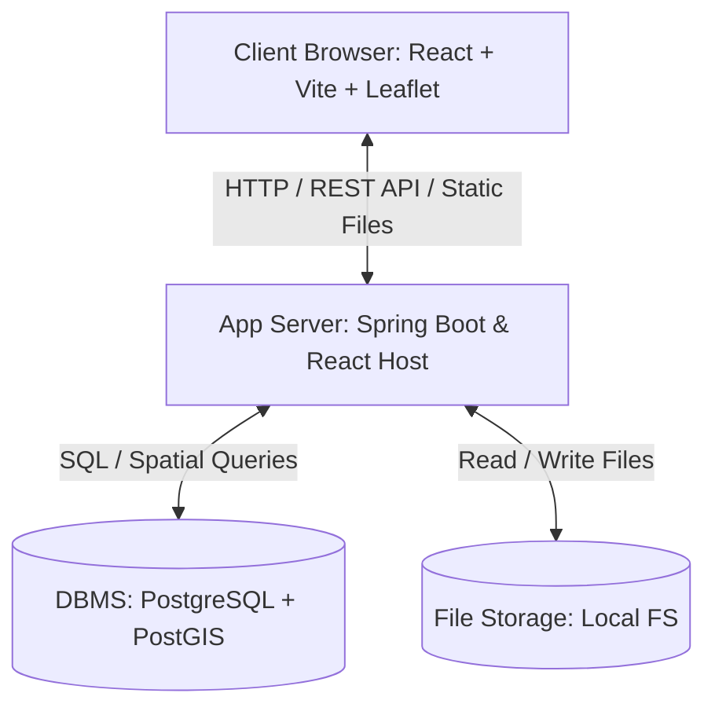

# PROVINCIAL ADMINISTRATIVE INFORMATION MANAGEMENT AND GIS LOOKUP SYSTEM

## PROJECT OVERVIEW & REQUIREMENTS SPECIFICATION

---

### 1. Project Introduction

The provincial administrative information management and lookup system is built to serve the administration of administrative and spatial geographical data for the **new Gia Lai province** (merged from the former Binh Dinh and Gia Lai provinces, using the official administrative code **52**).

The system allows managing, updating, and querying information of commune/ward/township administrative units under the province, while supporting scalability to manage agencies, public service institutions, and local points of interest (POI).

> [!IMPORTANT]
> **Infrastructure Requirement:** The system is deployed and self-managed on rented Virtual Private Server (VPS) infrastructure from domestic cloud providers (e.g., Viettel IDC, FPT Cloud, VNG Cloud). It operates independently without relying on paid third-party API services, ensuring absolute data security and sovereignty.

---

### 2. Implementation Roadmap (Phased Approach)

The project is divided into 3 development phases. The system is designed as a flexible, common framework (Template), supporting feature toggles for specific modules (Schools, Hospitals, etc.) based on each client's specific requirements at the package build time (Compile-time):

| Phase       | Phase Name                     | Core Deliverables                                                                                                                                                                                                                                                                                                                              |
| :---------- | :----------------------------- | :--------------------------------------------------------------------------------------------------------------------------------------------------------------------------------------------------------------------------------------------------------------------------------------------------------------------------------------------- |
| **Phase 1** | **Administrative Foundation**  | - Commune-level administrative map: Display Gia Lai borders, select and view area details directly on the map. - Administrative information lookup: Fast search of communes/wards. - User roles (ADMIN: account administration, VIEWER: map lookup). Direct data or boundary editing via the web is not supported.                       |
| **Phase 2** | **Affiliated Unit Management** | - Expand management registries for affiliated organizations and units at the commune/ward level as independent modules (Schools, Hospitals, Health Centers, Police, Tourist Spots, OCOP production units, etc.). - Develop Resource Management Module (Upload avatar, actual photos, attached files/documents for each organization).       |
| **Phase 3** | **GIS Map Integration**        | - Geopoint coordinate mapping (Point) and visualization of enabled modules' organizations on the map. - Establish spatial relations between organizations and managing administrative units. - Map-based queries (radius search, administrative area filter). - Visual reporting and analytics on the map via toggleable data layers. |

---

### 3. Technology Stack & Infrastructure

The system separates the Frontend (FE) and Backend (BE), using popular open-source technologies:

#### 3.1. Frontend Stack (Folder `/FE`)

- **Framework:** React with Vite and TypeScript.
- **Routing:** React Router.
- **State & Data Fetching:** TanStack Query (React Query).
- **Styling & UI Components:** Tailwind CSS combined with Shadcn UI.
- **GIS & Map:** Leaflet and React Leaflet.
  - _Base Map:_ Uses OpenStreetMap (OSM) Tile Layer.
  - _Spatial Data:_ Administrative boundaries stored in PostgreSQL/PostGIS in MultiPolygon format, returned as GeoJSON via API to render directly on the client, ensuring independence from paid map APIs.

#### 3.2. Backend Stack (Folder `/BE`)

- **Core Tech:** Java 17 + Spring Boot 3.x.
- **Security:** Spring Security (JWT-based authentication & authorization).
- **ORM / Data Access:** Spring Data JPA + Hibernate Spatial (supports PostGIS spatial data types).
- **API:** Standardized RESTful APIs.

#### 3.3. Database (DB)

- **DBMS:** PostgreSQL.
- **GIS Extension:** PostGIS (stores and processes spatial queries: Polygon, MultiPolygon, Point).
- **Province Code:** Uses official province code **52**.

#### 3.4. Deployment Architecture & Infrastructure

- **Server OS:** Ubuntu Server.
- **Containerization:** Docker & Docker Compose to package and run services (Spring Boot App with embedded React, PostgreSQL/PostGIS). No separate Nginx is required, simplifying maintenance for a single developer.
- **File Storage:**
  - _Current phase:_ Local storage directly on the server host folder for simplicity.
  - _Future extension:_ Can transition to MinIO/S3 as data scales.

---

### 4. Detailed Business Modules

#### 4.1. Authentication & Authorization Module

- **Features:**
  - System login (Generates JWT Access Token).
  - Logout and token invalidation.
  - Account security management.
- **Role Matrix:**
  - `ADMIN`: Full system privileges, manages other user accounts (view list, create, edit info, delete `VIEWER` accounts).
  - `VIEWER`: Read-only map search and administrative boundary lookups.

#### 4.2. Administrative Unit Management Module

- **Entities Managed:** Gia Lai Province (code 52), Communes/Wards/Townships (District/County level is not managed directly).
- **Detailed Attributes:**
  - Unit Code (National administrative code).
  - Unit Name (Official name).
  - Unit Type (Commune, Ward, Township).
  - Geographic Info: Area (km²), Head of unit (President of People's Committee, etc.).
  - Additional resources: Representative images, attached documents, brief description.
  - Spatial Data: Boundary borders (`MULTIPOLYGON` stored in PostGIS), center point coordinates for zoom/pan.
- **GIS Features:**
  - Render selected administrative boundary.
  - Highlight boundaries on hover or click.
  - Display popup/sidebar details upon interaction.
  - Fast search and automated map center adjustment to chosen unit.
  - Support nested selection filters: Province (52) $\rightarrow$ Commune/Ward.

#### 4.3. Affiliated Organization Management Module

- **Types of Organizations:** People's Committee, Police, Schools, Hospitals, Clinics, Tourist Spots, OCOP Cooperatives, Sci-Tech Units, etc.
- **Detailed Attributes:**
  - Organization Name, Organization Type.
  - Contact Info: Address, Phone, Email.
  - Representative image, detailed description.
  - Spatial link: Belongs to which commune/ward administrative unit (ensures referential integrity).

#### 4.4. Resource Management Module (Media & Storage)

- **Role:** Developed and integrated starting from **Phase 2** to support media attachment for affiliated entities (OCOP, Hospitals, Schools, etc.). These assets will be displayed within map popups when users click on points (Points of Interest).
- **Features:**
  - Upload images (JPEG, PNG) as avatars or actual photos of the organization.
  - Upload related documents (PDF, DOCX) and support direct downloads.
  - Automatically optimize image sizes upon upload to reduce storage size.
  - _Architecture:_ Implemented via interface-driven code (local storage in initial phases) to easily migrate to MinIO/S3 in the future.

#### 4.5. Dashboard & Analytics Module

- **Features:**
  - Count of administrative units under the province.
  - Area distribution and administrative structure statistics.
  - Count of affiliated organizations by category (Schools, Hospitals, Tourism...).
  - Export analytical reports in PDF or Excel formats.

#### 4.6. Advanced GIS Map Module (Phase 3)

- _Note: Phase 1 focuses on basic administrative boundaries, Phase 3 expands to:_
  - Load and toggle between different map layers (Administrative borders, Organization locations, etc.).
  - Render point markers for organizations (Hospitals, Schools, People's Committees) on top of the commune boundary map layer.
  - Spatial query: Search organizations within a specific commune or within a custom radius from a chosen location.

---

### 5. Spring Boot Dependencies

Libraries configured in the backend `pom.xml`:

| Group                 | Artifact ID                           | Core Functionality                                  |
| :-------------------- | :------------------------------------ | :-------------------------------------------------- |
| **Core**              | `spring-boot-starter-web`             | RESTful API creation                                |
|                       | `spring-boot-starter-data-jpa`        | DB connection and ORM                               |
|                       | `spring-boot-starter-validation`      | Inputs validation                                   |
|                       | `spring-boot-starter-security`        | JWT auth & role management                          |
|                       | `postgresql`                          | PostgreSQL driver                                   |
| **GIS**               | `hibernate-spatial`                   | Spatial data type integration for Hibernate         |
|                       | `jts-core`                            | Geometric processing library (JTS Topology Suite)   |
| **Utilities**         | `lombok`                              | Boilerplate code generation (Getters/Setters, etc.) |
|                       | `mapstruct`                           | DTO $\leftrightarrow$ Entity mapping                |
| **Docs & Monitoring** | `springdoc-openapi-starter-webmvc-ui` | Automated Swagger UI docs                           |
|                       | `spring-boot-starter-actuator`        | Application health monitoring                       |
| **Testing**           | `spring-boot-starter-test`            | Unit & Integration testing framework                |
|                       | `testcontainers-postgresql`           | Dynamic PostgreSQL Docker container for test env    |

---

### 6. Data Flow & Deployment Model

---

### 7. Modular & Pluggable Architecture Design (Modularity & Pluggability)

The system is designed to facilitate quick packaging and exclusion of unnecessary functional components depending on each customer's purchase order using **Compile-time Modularity**:

1. **Frontend (Vite/React):**
   - Utilizes environment variables (`VITE_ENABLE_SCHOOLS`, `VITE_ENABLE_HOSPITALS`, etc.) inside the `.env` file for each build target.
   - The Routing system and Menu Sidebar automatically inspect these environment variables to register or hide corresponding pages/functionalities.
2. **Backend (Spring Boot):**
   - Isolates specific feature modules into designated packages (e.g., `com.website.gis.features.school`).
   - Uses Spring Profiles along with conditional annotations like `@ConditionalOnProperty` to only instantiate controllers, services, and repositories when their respective feature toggles are enabled in the configuration file. If a feature is disabled, the corresponding endpoints will return 404.
3. **Database (PostgreSQL & Flyway):**
   - Partitions DDL/DML initialization scripts into dedicated Flyway folders (`db/migration/core` for the base admin boundaries, and separate folders like `db/migration/school`, `db/migration/hospital`, etc.).
   - During application startup, depending on active profiles, the system dynamically appends corresponding path locations to Flyway scan targets, avoiding the creation of unused tables in client databases.
4. **Deployment Isolation:**
   - Each customer runs as a fully separate application container **and** a fully separate database instance ("database-per-customer"), not a shared multi-tenant database with row-level filtering. This guarantees that one customer can never query or view another customer's specialized data, since there is no network or code path between them.
   - Multiple customer stacks may share a single Virtual Private Server (VPS) for cost efficiency, but this is purely an infrastructure placement decision and carries no code-level coupling.
   - See `ARCHITECTURE SPECIFICATION.md` (Sections 6–7) for the isolation model and rollout mechanics, and `DEPLOYMENT_AND_FLEET_STRATEGY.md` for the full operational runbook (fleet registry, build pipeline, rollout scripts, and standard runbooks for onboarding customers, emergency fixes, partial feature rollouts, and core data corrections).
