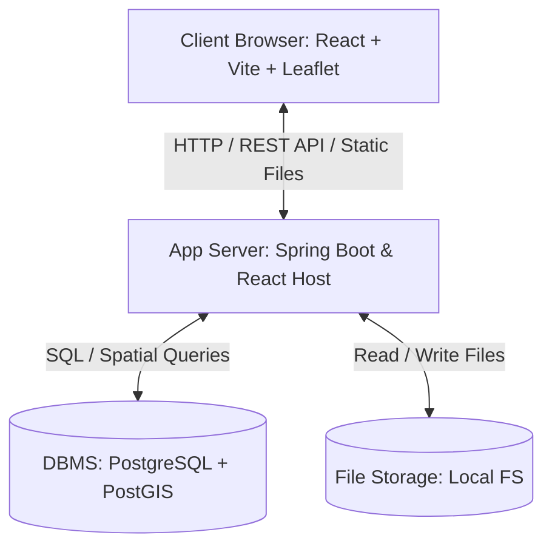

# PROVINCIAL ADMINISTRATIVE INFORMATION MANAGEMENT AND GIS LOOKUP SYSTEM

## PROJECT OVERVIEW & REQUIREMENTS SPECIFICATION

---

### 1. Project Introduction

The provincial administrative information management and lookup system is built to serve the administration of administrative and spatial geographical data for the **new Gia Lai province** (merged from the former Binh Dinh and Gia Lai provinces, using the official administrative code **52**).

The system allows managing, updating, and querying information of commune/ward/township administrative units under the province, while supporting scalability to manage agencies, public service institutions, and local points of interest (POI).

> [!IMPORTANT]
> **Infrastructure Requirement:** The system is deployed and self-managed on rented Virtual Private Server (VPS) infrastructure from domestic cloud providers (e.g., Viettel IDC, FPT Cloud, VNG Cloud). It operates independently without relying on paid third-party API services, ensuring absolute data security and sovereignty.

---

### 2. Implementation Roadmap (Phased Approach)

The project serves 3 distinct provincial client deployments sharing a common Administrative Core. The system is designed as a flexible, common framework (Template), supporting pluggable feature modules (OCOP, Science, Agriculture). Currently, **Client 1 (OCOP Gia Lai)** has completed production-grade business requirements, while **Clients 2 & 3 (Science & Agriculture)** have scaffold proof-of-concept modules in place awaiting specific requirement discovery:

| Phase       | Phase Name                     | Core Deliverables                                                                                                                                                                                                                                                                                                                              |
| :---------- | :----------------------------- | :--------------------------------------------------------------------------------------------------------------------------------------------------------------------------------------------------------------------------------------------------------------------------------------------------------------------------------------------- |
| **Phase 1** | **Administrative Foundation (Core)**  | - Shared by all 3 clients: Commune-level administrative map (135 wards of Gia Lai code 52), boundary display, fast search. - Authentication & user administration (ADMIN / VIEWER), JWT HttpOnly cookies. - Standardized storage service for media uploads (`/api/files`).                                                                  |
| **Phase 2** | **Affiliated Unit Management** | - **OCOP Module (Client 1 - Production):** Registry management for OCOP production facilities with multi-category product types, 1–5 star ratings, contact hotline, facility address, coordinate tracking, and image uploads. - **Science & Agriculture Modules (Scaffold):** Lightweight placeholder modules validating the pluggable architecture; to be customized when engaging the respective clients. |
| **Phase 3** | **GIS Map Integration**        | - Point-layer mapping and MarkerCluster visualization on Leaflet map. - Interactive coordinate map picker (`MapPicker`) for administrative forms. - Spatial radius search (`ST_DWithin` on geography with GiST indexes) and ward filtering. - Single source of truth layer control with synchronized visual legends.               |

---

### 3. Technology Stack & Infrastructure

The system separates the Frontend (FE) and Backend (BE), using popular open-source technologies:

#### 3.1. Frontend Stack (Folder `/FE`)

- **Framework:** React with Vite and TypeScript.
- **Routing:** React Router.
- **State & Data Fetching:** TanStack Query (React Query will be use in the phase 2, Phase 1 use directive local state for simple).
- **Styling & UI Components:** Tailwind CSS
- **GIS & Map:** Leaflet and React Leaflet.
  - _Base Map:_ CartoDB Light Tile Layer.
  - _Spatial Data:_ Administrative boundaries stored in PostgreSQL/PostGIS in MultiPolygon format, returned as GeoJSON via API to render directly on the client, ensuring independence from paid map APIs.

#### 3.2. Backend Stack (Folder `/BE`)

- **Core Tech:** Java 21 + Spring Boot 3.x.
- **Security:** Spring Security (JWT-based authentication & authorization).
- **ORM / Data Access:** Spring Data JPA + Hibernate Spatial (supports PostGIS spatial data types).
- **API:** Standardized RESTful APIs.

#### 3.3. Database (DB)

- **DBMS:** PostgreSQL.
- **GIS Extension:** PostGIS (stores and processes spatial queries: Polygon, MultiPolygon, Point).
- **Province Code:** Uses official province code **52**.

#### 3.4. Deployment Architecture & Infrastructure

- **Server OS:** Ubuntu Server.
- **Containerization:** Docker & Docker Compose to package and run services (Spring Boot App with embedded React, PostgreSQL/PostGIS). No separate Nginx is required, simplifying maintenance for a single developer.
- **File Storage:**
  - _Current phase:_ Local storage directly on the server host folder for simplicity.
  - _Future extension:_ Can transition to MinIO/S3 as data scales.

---

### 4. Detailed Business Modules

#### 4.1. Authentication & Authorization Module

- **Features:**
  - System login (Generates JWT Access Token).
  - Logout and token invalidation.
  - Account security management.
- **Role Matrix:**
  - `ADMIN`: Full system privileges, manages user accounts (view list, create `VIEWER` accounts, edit user info/passwords, delete accounts except own account and the last remaining `ADMIN`).
  - `VIEWER`: Read-only map search and administrative boundary lookups.

#### 4.2. Administrative Unit Management Module

- **Entities Managed:** Gia Lai Province (code 52), Communes/Wards/Townships (District/County level is not managed directly).
- **Detailed Attributes:**
  - Unit Code (National administrative code).
  - Unit Name (Official name).
  - Unit Type (Commune, Ward, Township).
  - Geographic Info: Area (km²).
  - Additional resources: Representative images, attached documents, brief description.
  - Spatial Data: Boundary borders (`MULTIPOLYGON` stored in PostGIS), center point coordinates for zoom/pan.
- **GIS Features:**
  - Render selected administrative boundary.
  - Highlight boundaries on hover or click.
  - Display popup/sidebar details upon interaction.
  - Fast search and automated map center adjustment to chosen unit.
  - Support nested selection filters: Province (52) $\rightarrow$ Commune/Ward.

#### 4.3. Affiliated Organization Management Module

- **Types of Organizations:** OCOP Cooperatives, Sci-Tech Units, Agricultural Units (3 independent modules).
- **Detailed Attributes:**
  - Organization Name, Organization Type.
  - Contact Info: Address, Phone, Email.
  - Representative image, detailed description.
  - Spatial link: Belongs to which commune/ward administrative unit (ensures referential integrity).

#### 4.4. Resource Management Module (Media & Storage)

- **Role:** Developed and integrated starting from **Phase 2** to support media attachment for affiliated entities (OCOP, Science, Agriculture). These assets will be displayed within map popups when users click on points (Points of Interest).
- **Features:**
  - Upload images (JPEG, PNG) as avatars or actual photos of the organization.
  - Upload related documents (PDF, DOCX) and support direct downloads.
  - Automatically optimize image sizes upon upload to reduce storage size.
  - _Architecture:_ Implemented via interface-driven code (local storage in initial phases) to easily migrate to MinIO/S3 in the future.

#### 4.5. Dashboard & Analytics Module

- **Features:**
  - Count of administrative units under the province.
  - Area distribution and administrative structure statistics.
  - Count of affiliated organizations by category (OCOP, Science, Agriculture).
  - Export analytical reports in PDF or Excel formats.

#### 4.6. Advanced GIS Map Module (Phase 3)

- _Note: Phase 1 focuses on basic administrative boundaries, Phase 3 expands to:_
  - Load and toggle between different map layers (Administrative borders, Organization locations, etc.).
  - Render point markers for organizations (OCOP units, Science units, Agriculture units) on top of the commune boundary map layer.
  - Spatial query: Search organizations within a specific commune or within a custom radius from a chosen location.

---

### 5. Spring Boot Dependencies

Libraries configured in the backend `pom.xml`:

| Group                 | Artifact ID                           | Core Functionality                                  |
| :-------------------- | :------------------------------------ | :-------------------------------------------------- |
| **Core**              | `spring-boot-starter-web`             | RESTful API creation                                |
|                       | `spring-boot-starter-data-jpa`        | DB connection and ORM                               |
|                       | `spring-boot-starter-validation`      | Inputs validation                                   |
|                       | `spring-boot-starter-security`        | JWT auth & role management                          |
|                       | `postgresql`                          | PostgreSQL driver                                   |
| **GIS**               | `hibernate-spatial`                   | Spatial data type integration for Hibernate         |
|                       | `jts-core`                            | Geometric processing library (JTS Topology Suite)   |
| **Utilities**         | `lombok`                              | Boilerplate code generation (Getters/Setters, etc.) |
|                       | `mapstruct`                           | DTO $\leftrightarrow$ Entity mapping                |
| **Docs & Monitoring** | `springdoc-openapi-starter-webmvc-ui` | Automated Swagger UI docs                           |
|                       | `spring-boot-starter-actuator`        | Application health monitoring                       |
| **Testing**           | `spring-boot-starter-test`            | Unit & Integration testing framework                |
|                       | `testcontainers-postgresql`           | Dynamic PostgreSQL Docker container for test env    |

---

### 6. Data Flow & Deployment Model

```mermaid
graph TD
    Client[Client Browser: React + Vite + Leaflet]
    API[App Server: Spring Boot & React Host]
    DB[(DBMS: PostgreSQL + PostGIS)]
    Storage[(File Storage: Local FS)]

    Client <-->|HTTP / REST API / Static Files| API
    API <-->|SQL / Spatial Queries| DB
    API <-->|Read / Write Files| Storage
```

---

### 7. Modular & Pluggable Architecture Design (Modularity & Pluggability)

The system delivers bespoke solutions for 3 client deployments from a single unified codebase while maintaining a **Single Runtime Artifact (Fat JAR/Docker Image)**:

1. **Frontend & Backend Modularity Coordination:**
   - **Backend (Spring Boot):** Isolates specific feature modules into dedicated packages (e.g., `com.website.gis.features.ocop`). Feature properties (`features.*.enabled`) paired with `@ConditionalOnProperty` dynamically toggle REST controllers, Spring Data JPA repositories, and Flyway migration scanning.
   - **Frontend (React/Vite):** In development, features can be toggled via environment variables (`VITE_ENABLE_*`). For production Docker deployments, to enable a **single built image** to serve any client stack, the frontend synchronizes active feature flags from the backend container at runtime, eliminating the need to rebuild separate frontend bundles for each customer.
2. **Database (PostgreSQL & Flyway Partitioning):**
   - Partitioned Flyway migration folders (`db/migration/core`, `db/migration/ocop`, `db/migration/science`, `db/migration/agriculture`).
   - Active database instances only execute migrations corresponding to enabled modules via `DynamicFlywayConfig`, keeping client schemas clean and free from unused tables.
3. **Multi-Tenant Deployment Topology (1 VPS, 3 Containers, 3 Databases):**
   - All 3 customer instances run on **1 physical VPS** (e.g. Viettel IDC) for cost efficiency.
   - Strict isolation is enforced via **container-per-customer** and **database-per-customer** (`gialai_ocop`, `gialai_science`, `gialai_agriculture`). There is zero cross-tenant database sharing or network coupling.
   - A reverse proxy (Caddy) routes client subdomains (`ocop.gialai.gov.vn`, `khcn.gialai.gov.vn`, `nongnghiep.gialai.gov.vn`) to the appropriate container with automatic SSL termination.
   - See `ARCHITECTURE SPECIFICATION.md` (Sections 6–7) and `DEPLOYMENT & FLEET STRATEGY.md` for full operational and isolation specifications.
