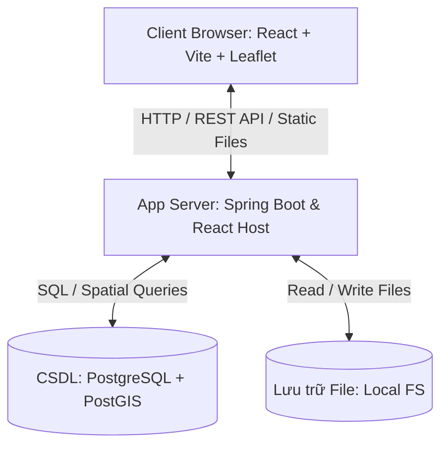

# HỆ THỐNG QUẢN LÝ VÀ TRA CỨU THÔNG TIN HÀNH CHÍNH TỈNH GIA LAI

## TÀI LIỆU TỔNG QUAN DỰ ÁN & ĐẶC TẢ YÊU CẦU

---

### 1. Giới thiệu dự án

Hệ thống quản lý và tra cứu thông tin hành chính cấp tỉnh được xây dựng nhằm phục vụ công tác quản lý dữ liệu hành chính và địa lý không gian cho **tỉnh Gia Lai mới** (được hợp nhất từ hai tỉnh Bình Định và Gia Lai cũ, sử dụng mã hành chính chính thức là **52**).

Hệ thống cho phép quản lý, cập nhật và tra cứu thông tin các đơn vị hành chính cấp xã/phường/thị trấn trực thuộc tỉnh, đồng thời hỗ trợ mở rộng quản lý các tổ chức, đơn vị sự nghiệp, dịch vụ công và điểm tiện ích trực thuộc địa bàn.

> [!IMPORTANT]
> **Yêu cầu hạ tầng:** Hệ thống được triển khai tự vận hành trên hạ tầng máy chủ ảo riêng (VPS) thuê từ các nhà cung cấp đám mây trong nước (Viettel IDC, FPT Cloud, VNG Cloud,...). Hệ thống hoạt động độc lập, không phụ thuộc vào các dịch vụ API trả phí của bên thứ ba, bảo đảm chủ quyền dữ liệu và an toàn thông tin tuyệt đối.

---

### 2. Kế hoạch triển khai (Phân kỳ Giai đoạn)

Dự án được chia làm 3 giai đoạn phát triển cuốn chiếu. Hệ thống được thiết kế dưới dạng khung chung (Template) linh hoạt, hỗ trợ bật/tắt (Feature Toggle) các module (Trường học, Bệnh viện...) tùy theo yêu cầu của từng khách hàng tại thời điểm đóng gói (Compile-time):

| Giai đoạn       | Tên phân kỳ                       | Nội dung thực hiện chính                                                                                                                                                                                                                                                                                                                                     |
| :-------------- | :-------------------------------- | :----------------------------------------------------------------------------------------------------------------------------------------------------------------------------------------------------------------------------------------------------------------------------------------------------------------------------------------------------------- |
| **Giai đoạn 1** | **Nền tảng hành chính**           | - Bản đồ hành chính cấp xã: hiển thị ranh giới địa giới hành chính Gia Lai, tương tác chọn và xem chi tiết diện tích trực tiếp trên bản đồ. - Tra cứu thông tin hành chính, tìm kiếm nhanh xã/phường. - Phân quyền người dùng (ADMIN quản trị tài khoản, VIEWER tra cứu bản đồ). Không có tính năng chỉnh sửa dữ liệu hay địa giới trực tiếp trên web. |
| **Giai đoạn 2** | **Quản lý đơn vị trực thuộc**     | - Mở rộng quản lý danh mục tổ chức, đơn vị trực thuộc trên địa bàn xã/phường dưới dạng các module độc lập (Trường học, Bệnh viện, Trạm y tế, Công an, Điểm du lịch, OCOP...). - Phát triển Module Quản lý Tài nguyên (Tải lên hình ảnh đại diện, hình ảnh thực tế, tài liệu đính kèm cho từng đơn vị trực thuộc).                                         |
| **Giai đoạn 3** | **Tích hợp bản đồ mở rộng (GIS)** | - Định vị tọa độ (Point) và hiển thị vị trí các đơn vị trực thuộc của các module được kích hoạt trên bản đồ. - Thiết lập liên kết không gian giữa đơn vị trực thuộc và đơn vị hành chính quản lý. - Tra cứu, tìm kiếm theo bán kính/khu vực địa lý. - Thống kê, báo cáo trực quan hóa dữ liệu trên bản đồ theo các lớp (layer) dữ liệu khác nhau.   |

---

### 3. Kiến trúc công nghệ & Hạ tầng

Hệ thống áp dụng kiến trúc tách biệt Frontend (FE) và Backend (BE), sử dụng các công nghệ mã nguồn mở phổ biến:

#### 3.1. Frontend Stack (Thư mục `/FE` - Khởi tạo sau)

- **Framework:** React (với Vite) kết hợp TypeScript.
- **Routing:** React Router.
- **State & Data Fetching:** TanStack Query (React Query).
- **Styling & UI Components:** Tailwind CSS kết hợp Shadcn UI.
- **GIS & Bản đồ:** Leaflet và React Leaflet.
  - _Bản đồ nền:_ Sử dụng CartoDB Light Tile Layer làm nền.
  - _Dữ liệu không gian:_ Ranh giới hành chính lưu trữ tại PostgreSQL/PostGIS dưới định dạng MultiPolygon được API trả về dưới dạng GeoJSON để render trực tiếp ở client, bảo đảm không phụ thuộc vào API bản đồ trả phí bên ngoài.

#### 3.2. Backend Stack (Thư mục `/BE`)

- **Công nghệ lõi:** Java 17 + Spring Boot 3.x.
- **Bảo mật:** Spring Security (Xác thực & phân quyền dựa trên JWT).
- **ORM / Truy cập dữ liệu:** Spring Data JPA + Hibernate Spatial (hỗ trợ xử lý kiểu dữ liệu địa lý PostGIS).
- **API:** RESTful API chuẩn hóa.

#### 3.3. Cơ sở dữ liệu (Database)

- **Hệ quản trị CSDL:** PostgreSQL.
- **Tiện ích mở rộng GIS:** PostGIS (lưu trữ và xử lý truy vấn không gian hình học Polygon, MultiPolygon, Point).
- **Mã tỉnh:** Sử dụng mã tỉnh chính thức là **52**.

#### 3.4. Kiến trúc triển khai & Hạ tầng

- **Hệ điều hành máy chủ:** Ubuntu Server.
- **Container hóa:** Docker & Docker Compose để đóng gói và vận hành các service (Spring Boot App tích hợp React, PostgreSQL/PostGIS). Không cần Nginx độc lập để đơn giản hóa vận hành cho 1 lập trình viên.
- **Lưu trữ tệp tin:**
  - _Giai đoạn hiện tại:_ Lưu trữ cục bộ (Local Storage) trực tiếp trên thư mục máy chủ để tối ưu sự đơn giản.
  - _Định hướng mở rộng:_ Có thể chuyển đổi sang MinIO/S3 khi dữ liệu phát triển lớn trong tương lai.

---

### 4. Các Module nghiệp vụ chi tiết

#### 4.1. Module Xác thực & Phân quyền (Authentication & Authorization)

- **Chức năng:**
  - Đăng nhập hệ thống (Sinh JWT Access Token).
  - Đăng xuất và vô hiệu hóa Token.
  - Quản lý bảo mật tài khoản.
- **Phân quyền (Roles Matrix):**
  - `ADMIN`: Toàn quyền hệ thống, quản lý tài khoản người dùng khác (Xem danh sách, Tạo mới, Thay đổi thông tin, Xóa tài khoản `VIEWER`).
  - `VIEWER`: Quyền tra cứu thông tin (Chỉ đọc, tìm kiếm thông tin và xem bản đồ ranh giới hành chính).

#### 4.2. Module Quản lý Đơn vị Hành chính (Administrative Unit)

- **Đối tượng quản lý:** Tỉnh Gia Lai (mã 52), Xã/Phường/Thị trấn (Không quản lý cấp Quận/Huyện).
- **Trường dữ liệu chi tiết:**
  - Mã đơn vị (Mã hành chính quốc gia).
  - Tên đơn vị (Tên gọi chính thức).
  - Loại đơn vị (Xã, Phường, Thị trấn).
  - Thông tin địa lý: Diện tích (km²), Người đứng đầu (Chủ tịch UBND, vv).
  - Tài liệu bổ sung: Hình ảnh tiêu biểu, văn bản đính kèm, mô tả tóm tắt.
  - Dữ liệu không gian: Ranh giới địa lý (`MULTIPOLYGON` lưu trong PostGIS), Tọa độ trung tâm (Center point) phục vụ zoom/pan bản đồ.
- **Tính năng GIS:**
  - Hiển thị trực quan ranh giới của đơn vị hành chính được chọn.
  - Tô sáng (Highlight) đường biên địa giới khi hover hoặc click.
  - Hiển thị Popup/Sidebar thông tin chi tiết của đơn vị ngay trên bản đồ.
  - Tìm kiếm nhanh và tự động di chuyển bản đồ đến vị trí đơn vị hành chính được chọn.
  - Hỗ trợ lọc phân cấp tương tác trực tiếp: Tỉnh (52) $\rightarrow$ Xã/Phường.

#### 4.3. Module Quản lý Tổ chức & Đơn vị trực thuộc (Organization)

- **Phân loại tổ chức:** UBND các cấp, Công an, Trường học, Bệnh viện, Trạm y tế, Điểm du lịch, Hợp tác xã OCOP, Đơn vị KHCN, và các đơn vị khác.
- **Trường dữ liệu chi tiết:**
  - Tên tổ chức, Loại hình tổ chức.
  - Thông tin liên hệ: Địa chỉ chi tiết, Số điện thoại, Email.
  - Hình ảnh đại diện, mô tả chi tiết.
  - Liên kết không gian: Thuộc quản lý hành chính của Xã/Phường nào (đảm bảo tính nhất quán dữ liệu).

#### 4.4. Module Quản lý Tài nguyên (Media & Storage - Triển khai từ Giai đoạn 2)

- **Vai trò triển khai:** Được phát triển và tích hợp trong **Giai đoạn 2** để hỗ trợ quản lý hình ảnh cho các đơn vị trực thuộc (OCOP, Bệnh viện, Trường học, v.v.). Khi người dùng nhấn vào các điểm đối tượng (Points) này trên bản đồ, hình ảnh sẽ hiển thị như một phần thông tin chi tiết.
- **Chức năng:**
  - Hỗ trợ tải lên (Upload) hình ảnh (JPEG, PNG) làm ảnh đại diện hoặc ảnh thực tế của đơn vị trực thuộc.
  - Hỗ trợ tải lên tài liệu liên quan (PDF, DOCX) và hỗ trợ tải xuống (Download) trực tiếp.
  - Tự động tối ưu dung lượng ảnh khi upload để giảm tải dung lượng lưu trữ trên máy chủ.
  - _Kiến trúc:_ Triển khai dưới dạng Interface-driven (Local Storage ở máy chủ trong giai đoạn đầu) để dễ dàng chuyển đổi sang MinIO/S3 trong tương lai.

#### 4.5. Module Trang tổng quan (Dashboard & Analytics)

- **Chức năng:**
  - Thống kê số lượng đơn vị hành chính trực thuộc tỉnh.
  - Thống kê diện tích và phân bố cơ cấu hành chính.
  - Thống kê số lượng tổ chức trực thuộc phân loại theo loại hình (Trường học, y tế, điểm du lịch,...).
  - Xuất báo cáo thống kê dạng PDF hoặc Excel.

#### 4.6. Module Bản đồ chuyên sâu (GIS - Giai đoạn 3)

- _Lưu ý: Giai đoạn 1 tập trung hiển thị ranh giới hành chính cơ bản, giai đoạn này sẽ mở rộng:_
  - Tải và chuyển đổi qua lại giữa các lớp dữ liệu bản đồ khác nhau (Lớp ranh giới hành chính, Lớp định vị tổ chức, v.v.).
  - Hiển thị marker định vị tọa độ tổ chức (UBND, Trường học, Bệnh viện) trên nền bản đồ ranh giới xã.
  - Tìm kiếm không gian: Tìm kiếm các tổ chức trực thuộc trong phạm vi xã hoặc bán kính tùy chọn từ một vị trí.

---

### 5. Khai báo Spring Boot Dependencies

Dưới đây là danh sách thư viện được thiết lập trong dự án backend `pom.xml`:

| Nhóm thư viện         | Artifact ID                           | Chức năng chính                                        |
| :-------------------- | :------------------------------------ | :----------------------------------------------------- |
| **Core**              | `spring-boot-starter-web`             | Xây dựng RESTful API                                   |
|                       | `spring-boot-starter-data-jpa`        | Kết nối CSDL và thao tác ORM                           |
|                       | `spring-boot-starter-validation`      | Kiểm tra dữ liệu đầu vào                               |
|                       | `spring-boot-starter-security`        | Quản lý xác thực JWT & phân quyền                      |
|                       | `postgresql`                          | Driver kết nối CSDL PostgreSQL                         |
| **GIS**               | `hibernate-spatial`                   | Tích hợp kiểu dữ liệu địa lý cho Hibernate             |
|                       | `jts-core`                            | Thư viện xử lý tính toán hình học (JTS Topology Suite) |
| **Utilities**         | `lombok`                              | Tự động sinh Boilerplate code (Getter, Setter,...)     |
|                       | `mapstruct`                           | Hỗ trợ ánh xạ DTO $\leftrightarrow$ Entity             |
| **Docs & Monitoring** | `springdoc-openapi-starter-webmvc-ui` | Tự động sinh tài liệu Swagger UI                       |
|                       | `spring-boot-starter-actuator`        | Giám sát trạng thái hoạt động hệ thống                 |
| **Testing**           | `spring-boot-starter-test`            | Framework viết Unit & Integration Tests                |
|                       | `testcontainers-postgresql`           | Khởi chạy DB PostgreSQL Docker cho môi trường test     |

---

### 6. Mô hình luồng dữ liệu & Triển khai

---

### 7. Nguyên lý Thiết kế Kiến trúc Tùy biến (Modularity & Pluggability)

Hệ thống được thiết kế để dễ dàng đóng gói và loại bỏ các thành phần chức năng không cần thiết theo từng đơn hàng của khách hàng thông qua cơ chế **Compile-time Modularity**:

1. **Frontend (Vite/React):**
   - Sử dụng các biến môi trường (`VITE_ENABLE_SCHOOLS`, `VITE_ENABLE_HOSPITALS`,...) trong file `.env` của từng bản build.
   - Hệ thống Routing và Menu Sidebar sẽ tự động đọc các biến này để đăng ký hoặc ẩn các trang/chức năng tương ứng.
2. **Backend (Spring Boot):**
   - Chia tách mã nguồn các đối tượng đặc thù thành các package/module riêng biệt dưới dạng tính năng (ví dụ: `com.website.gis.features.school`).
   - Sử dụng Spring Profiles kết hợp các annotation điều kiện như `@ConditionalOnProperty` để chỉ kích hoạt các Controller/Service/Repository khi module đó được kích hoạt trong tệp cấu hình. Nếu module bị tắt, API Endpoint tương ứng sẽ không đăng ký và trả về lỗi 404.
3. **Cơ sở dữ liệu (PostgreSQL & Flyway):**
   - Phân mảnh các script DDL/DML khởi tạo cơ sở dữ liệu thành các thư mục Flyway riêng biệt (ví dụ: `db/migration/core` chứa bảng hành chính cơ bản, và các thư mục độc lập `db/migration/school`, `db/migration/hospital`...).
   - Khi khởi chạy ứng dụng, dựa vào các profile cấu hình đang hoạt động, hệ thống sẽ chỉ định Flyway quét các thư mục migrations tương ứng, tránh tạo các bảng dữ liệu thừa trong DB của khách hàng.
4. **Cô lập trong triển khai:**
   - Mỗi khách hàng hoạt động như một container ứng dụng hoàn toàn tách biệt **và** sử dụng một instance cơ sở dữ liệu riêng biệt (mô hình "mỗi khách hàng một cơ sở dữ liệu"), thay vì dùng chung cơ sở dữ liệu đa khách hàng (multi-tenant) với cơ chế lọc dữ liệu ở cấp độ dòng. Điều này đảm bảo rằng một khách hàng không bao giờ có thể truy vấn hoặc xem dữ liệu riêng của khách hàng khác, do không có kết nối mạng hay đường dẫn mã nguồn nào giữa chúng.
   - Các stack của nhiều khách hàng có thể dùng chung một máy chủ ảo riêng (VPS) để tối ưu chi phí, nhưng đây hoàn toàn là quyết định về bố trí hạ tầng và không tạo ra sự phụ thuộc lẫn nhau ở cấp độ mã nguồn.
   - Vui lòng tham khảo `ARCHITECTURE SPECIFICATION.md` (Mục 6–7) để biết chi tiết về mô hình cô lập và cơ chế triển khai, cũng như `DEPLOYMENT_AND_FLEET_STRATEGY.md` để xem quy trình vận hành đầy đủ (bao gồm đăng ký hệ thống/fleet, quy trình build, tập lệnh triển khai, và các quy trình chuẩn cho việc tiếp nhận khách hàng, xử lý sự cố khẩn cấp, triển khai tính năng từng phần và hiệu chỉnh dữ liệu cốt lõi).
